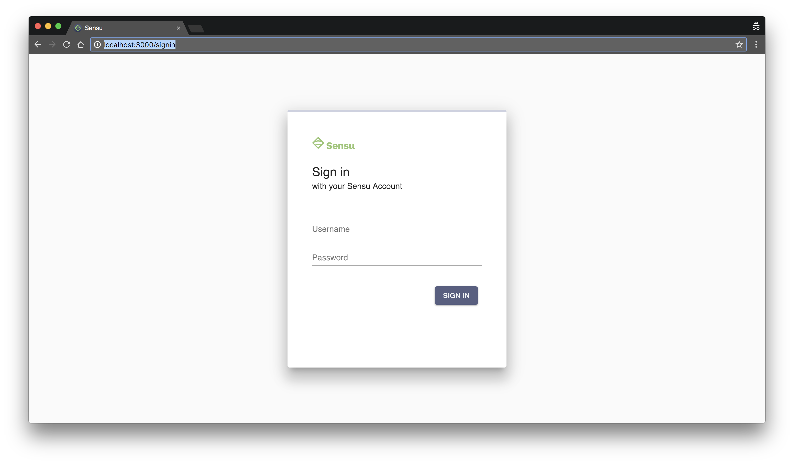

# Sensu Go Workshop

- [Overview](#overview)
  - [What is Sensu?](#what-is-sensu)
  - [Observability Pipeline](#observability-pipeline)
- [Workshop](#workshop)
  - [Setup](#setup)
  - [Lesson 1: Introduction to Sensu Go](#lesson-1-introduction-to-sensu-go)
  - [Lesson 2: Introduction to `sensu-agent`](#lesson-2-introduction-to-sensu-agent)

## Overview 

This project is intended to provide a simple template for developing training 
modules for Sensu Go. The workshop lessons outlined below are effectively the 
introductory modules – they are designed to help new Sensu users learn the 
basic concepts of an [Observability Pipeline][0] and help them get started 
with Sensu Go. 

This project has also be designed with both self-guided learning _and_ 
instructor-led training workshops in mind. It's easy to deploy the workshop 
environment on a laptop for personal use, or to a shared server (or cloud 
provider) for multiple users. See [SETUP.md][1] for more information on 
setting up the workshop environment. 

### What is Sensu?

==COMING SOON==

### Observability Pipeline 

==COMING SOON==

## Workshop

### Setup

This workshop is designed to be simple enough for self-guided training, while 
also providing a tool for trainers to host a workshop for multiple attendees. 
See [SETUP.md][1] for more details on setting up the workshop environment. 

Once you have deployed a workshop environment, you may proceed with the 
following local workstation setup instructions which will help you install 
the Sensu Go CLI (`sensuctl`) and connect to your workshop environment.

1. Clone this repository & configure your local environment.  

   Self-guided trainees may skip this step, as you should have already 
   downloaded the workshop materials as part of the instructions in 
   [SETUP.md][1].

   ```
   $ git clone git@github.com:calebhailey/sensu-go-workshop.git 
   $ cd sensu-go-workshop/ 
   $ export $(cat .env | grep -v "#" | grep =)
   $ echo $WORKSHOP_VERSION
   0.2.0
   ```

   > _NOTE: if you don't see a workshop version number printed out after the 
   > `echo $WORKSHOP_VERSION` command, please check with your instructor._   
   
2. Visit the Sensu web app!  

   - **Self guided trainees**: please visit http://127.0.0.1:3000 and login 
     with the default workshop username (`sensu`) and password (`sensu`).  
   - **Instructor-led workshop trainees**: please use the URL, username, and 
     password as provided your instructor.  
     
   You should see a login screen that looks like this: 
   
   
     
   > _TROUBLESHOOTING: no login screen? Please consult with your instructor, or
   > double-check that you complete all of the steps in [SETUP.md][1] before 
   > proceding._

3. Install and configure a local `sensuctl` (the Sensu Go CLI).

   Mac users:

   ```
   $ curl -LO https://s3-us-west-2.amazonaws.com/sensu.io/sensu-go/${SENSU_CLI_VERSION}/sensu-go_${SENSU_CLI_VERSION}_darwin_amd64.tar.gz
   $ sudo tar -xzf sensu-go_${SENSU_CLI_VERSION}_darwin_amd64.tar.gz -C /usr/local/bin/
   ```

   > _NOTE: Linux and Windows users can find [installation instructions][2] in the 
     Sensu [user documentation][3]. The complete list of Sensu downloads is 
     available at https://sensu.io/downloads._

   Configure the Sensu CLI to connect to your backend by running the `sensuctl 
   configure` command. Sensuctl will prompt you to provide a Sensu Backend URL, 
   username, password, namespace, and preferred output format.  
   
   ```
   $ sensuctl configure
     ? Sensu Backend URL: http://127.0.0.1:8080
     ? Username: sensu
     ? Password: *****
     ? Namespace: default
     ? Preferred output format:
     ❯ tabular
       yaml
       wrapped-json
       json
   ```
   
   > _NOTE: self-guided trainees who are running the workshop on their local 
     workstation should use the default backend URL (`http://127.0.0.1:8080`), 
     username (`sensu`), and password (`sensu`). Trainees in instructor-led 
     workshops should use the URL and credentials provided by the instructor._
   
4. Create an API Key. 

   To create a [Sensu API Key][4], use the `sensuctl api-key grant` command: 
   
   ```
   $ sensuctl api-key grant sensu
   Created: /api/core/v2/apikeys/xxxxxxxx-xxxx-xxxx-xxxx-xxxxxxxxxxxx
   ```
   
   For our purposes, we want to capture this API key (the 
   `xxxxxxxx-xxxx-xxxx-xxxx-xxxxxxxxxxxx` part of the output) as an environment
   variable. You can either copy the output from the `sensuctl api-key grant`
   command manually, like this: 
   
   ```
   $ export SENSU_API_KEY=xxxxxxxx-xxxx-xxxx-xxxx-xxxxxxxxxxxx
   ```
   
   Or run the following command: 
   
   ```
   $ export SENSU_API_KEY=$(sensuctl api-key grant sensu | awk -F "/" '{print $NF}')
   ```
   
   > _NOTE: self-guided trainees should grant an api-key for the `sensu` user,
     as shown above. Trainees in instructor-led workshops should create an 
     api-key for their own user, using the username provided by the instructor 
     (e.g. `sensuctl api-key grant <username>`)._ 
   
### Lesson 1: introduction to Sensu Go

The following guide will walk you through the basic concepts behind the 
observability pipeline, and prepare you to start configuration your own 
monitoring and observability workflows using Sensu. The guide starts with a 
fresh Sensu installation, and assumes certain companion services are available 
(e.g. a data platform such as Prometheus, TimescaleDB, Elasticsearch, or 
Splunk; and a graphing solution such as Grafana, Kibana, or Splunk's built-in 
dashboards). 

Multiple reference architectures will be provided for use with this workshop. 
Please consult [SETUP.md][1] for more information. 

1. **Configure an handler to process observability data**

   The first thing we need to do with a fresh Sensu installation is configure 
   one or more [Sensu event handlers][5] to process observability data. 
   Handlers are actions the Sensu backend executes on events, such as sending 
   alerts or routing events and metrics to one or more data platforms.
   
   Handlers are sometimes referred to as "integrations" since they let you 
   connect Sensu to tools like Slack, Pagerduty, ServiceNow, Jira, InfluxDB,
   Prometheus, TimescaleDB, Elasticsearch, Splunk, and many many more. 
   
   To get started, let's configure the Sensu Pagerduty handler using the 
   template provided with this workshop (see 
   `lessons/1/pipelines/pagerduty.yaml`):

   ```
   $ sensuctl create -f lessons/1/pipelines/pagerduty.yaml
   $ sensuctl handler list
       Name      Type   Timeout           Filters            Mutator              Execute              Environment Variables                 Assets
    ─────────── ────── ───────── ────────────────────────── ───────── ─────────────────────────────── ─────────────────────── ─────────────────────────────────────
     pagerduty   pipe         0   is_incident,not_silenced             RUN:  sensu-pagerduty-handler                           sensu/sensu-pagerduty-handler:1.3.2
   ```
   
   Congratulations! You just configured your first Sensu handler! 

2. **Publish an event to the pipeline** 

   Let's publish our first event to the pipeline using `curl` and the 
   [Sensu Events API][6]. 

   ```
   $ curl -i -XPOST -H "Authorization: Key $SENSU_API_KEY" \
          -H "Content-Type: application/json" \
          -d '{"entity":{"metadata":{"name":"server-01"},"entity_class":"proxy"},"check":{"metadata":{"name":"my-app"},"status":2,"interval":5,"output":"ERROR: failed to connect to database."}}' \
          http://127.0.0.1:8080/api/core/v2/namespaces/default/events
   HTTP/1.1 201 Created
   Content-Type: application/json
   Sensu-Entity-Count: 2
   Sensu-Entity-Limit: 100
   Sensu-Entity-Warning:
   Date: Thu, 06 Aug 2020 22:19:57 GMT
   Content-Length: 0
   ```   
   
   Success! We should not be able to see the event in Sensu using `sensuctl` 
   or the Sensu web UI (. 

   ```
   $ sensuctl event list
        Entity        Check                                     Output                                   Status   Silenced             Timestamp                             UUID                  
    ────────────── ─────────── ──────────────────────────────────────────────────────────────────────── ──────── ────────── ─────────────────────────────── ────────────────────────────────────── 
     405628f1ce39   keepalive   Keepalive last sent from 405628f1ce39 at 2020-08-06 22:23:02 +0000 UTC        0   false      2020-08-06 15:23:02 -0700 PDT   c88b8116-7196-4052-94c7-546e7e45969a  
     server-01      my-app      ERROR: failed to connect to database.                                         2   false      2020-08-06 15:19:57 -0700 PDT   8434c06f-ed34-4ac6-b0fb-343c1fc492a0  
   ```   

3. Enrich observations with additional context, and modify pipeline behaviors

   ==COMING SOON==

4. Discovery & inventory 

   ==COMING SOON==

5. Create & resolve incidents  

   ==COMING SOON==
   
6. Collect & process metrics 

   ==COMING SOON==
   
7. Pipeline filtering 

   ==COMING SOON==

### Lesson 2: introduction to `sensu-agent`

1. Install and configure your first agent 

   ==COMING SOON==
   
2. Publish events to the pipeline via the Agent API 

   ==COMING SOON==
   
3. Configure your first check/monitor (automated event collection)

   ==COMING SOON==

4. Output Metric Extraction 

   ==COMING SOON==

5. Agent StatsD Socket 

   ==COMING SOON==


[0]:  #observability-pipeline 
[1]:  /docs/SETUP.md
[2]:  https://docs.sensu.io/sensu-go/latest/operations/deploy-sensu/install-sensu/#install-sensuctl
[3]:  https://docs.sensu.io/sensu-go/latest/
[4]:  https://docs.sensu.io/sensu-go/latest/reference/apikeys/
[5]:  https://docs.sensu.io/sensu-go/latest/reference/handlers/
[6]:  https://docs.sensu.io/sensu-go/latest/api/events/
[7]:  #
[8]:  #
[9]:  #
[10]: #
[11]: #
