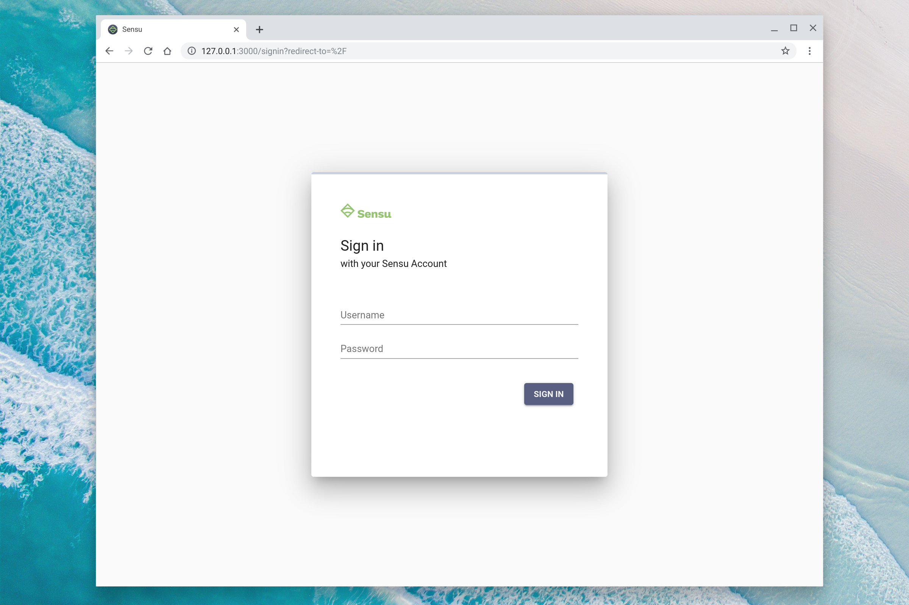
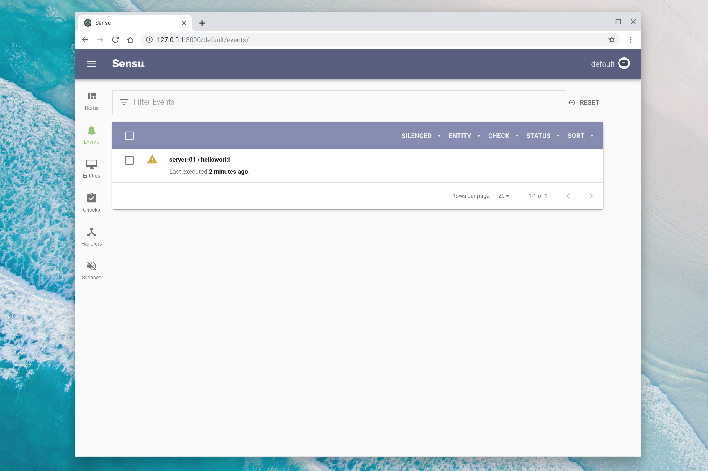

# Monitoring Event Pipeline

## What is Sensu?

Simple. Scalable. Multi-cloud monitoring.

Sensu provides complete visibility from bare metal to kubernetes &mdash; across
**every system, every protocol, every time**. Sensu is the solution to the
monitoring problems facing modern enterprises today, and the right foundation
for your organization tomorrow.

### How does it work?

Sensu is a cloud native Monitoring Event Pipeline (MEP), which provides a highly
configurable and extensible platform for monitoring infrastructure, services,
and applications in a hybrid or multi cloud environment.

### What is a monitoring event pipeline?


### What can you do with a monitoring event pipeline?

A Monitoring Event Pipeline is a framework for hybrid cloud infrastructure and
application _monitoring workflow automation_.

- **Consolidate monitoring tools** (Nagios, synthetics, etc)
- Automate system reliability & **improve SRE retention**
- Automated **compliance monitoring** (inspec, osquery)
- Enterprise monitoring **governance solution**

Here are just a few example workflows:


### What are monitoring events?

Monitoring events are an abstraction for service health information, telemetry
data, discovery, and alerts.

```json
{                           
  "timestamp": 1562526342,     
  "entity": {                  
    "metadata": {              
      "name": "server-01",     
      "namespace": "default"       
    }                        
  },                        
  "check": {               
    "metadata": {
      "name": "helloworld",
      "namespace": "default"
    },
    "output": "Hello, world!",
    "status": 1,
    "state": "failing",
    "handlers": [            
      "slack"         
    ]
  }
}

```

### The Sensu Agent &ndash; a powerful event producer

The Sensu Agent provides compatibility with popular and standards-based
interfaces, and converts their outputs into monitoring events that can be
processed by the Sensu backend.

Some example interfaces include Nagios/Icinga/Zabbix plugins, Prometheus
endpoints (exporting Prometheus metrics), StatsD, SNMP, and more.


## Workshop

Enough talk, let's walk through a hands-on workshop. Clone this repository, and
follow along this guide to get started automating your monitoring workflows
today!

### 0. Prerequisites

These are the non-Sensu resources you will need for this workshop:

1. **Docker**. We'll deploy Sensu on your workstation using Docker.

2. **Slack** (and a valid Slack Webhook URL). We'll send monitoring alerts from
   Sensu to Slack.

3. **InfluxDB & Grafana**. We'll send telemetry data from Sensu to InfluxDB (see
   [Appendix A: InfluxDB & Grafana][0.3a]).

   [0.3a]: #appendix-a-influxdb--grafana

### 1. Setup

1. **Sign up for a FREE 30-day trial of Sensu Go**. This workshop includes usage
   of certain [licensed features in Sensu Go ][1.1a], which extends the
   functionality of the open source project with important features for larger
   scale deployments or security conscious organizations (to learn more, please
   visit our [products page][1.1b]). To get a Sensu Go license key, please
   visit: https://account.sensu.io/users/sign_up?plan=gold (**no credit card
   required**). Once you have registered for your free trial, download a
   `license.json` file.

   [1.1a]: https://sensu.io/features/enterprise
   [1.1b]: https://sensu.io/products/

2. **Install the Sensu Go CLI (`sensuctl`)**.

   ```shell
   curl -L -o sensu-go.tar.gz https://s3-us-west-2.amazonaws.com/sensu.io/sensu-go/5.10.2/sensu-enterprise-go_5.10.2_linux_amd64.tar.gz
   tar -xzf sensu-go.tar.gz -C /usr/local/bin/
   rm sensu-go.tar.gz
   ```

   For installation on other platforms including Windows and Linux, please visit
   our [downloads][1.2a] page and [installation guide][1.2b].

   [1.2a]: https://sensu.io/downloads
   [1.2b]: https://docs.sensu.io/sensu-go/latest/installation/install-sensu/

3. **Deploy a local Sensu Go backend & configure `sensuctl`**.

   ```shell
   docker network create workshop
   docker run -d --rm --name sensu-backend --label "role=sensu-backend" \
     --network workshop -p 8080:8080 -p 8081:8081 -p 3000:3000 \
     sensu/sensu:latest sensu-backend start --log-level=debug
   sensuctl configure -n --url http://127.0.0.1:8080 \
     --username admin \
     --password "P@ssw0rd!" \
     --namespace default
   sensuctl create -f license.json
   ```

   Verify your install by visiting [http://127.0.0.1:3000][1.3a] from your
   browser. You can login with the default username (`admin`) and password
   (`P@ssw0rd!`).

   

   You're all set! Now let's jump into the first workshop!

   [1.3a]: http://127.0.0.1:3000

### 2. Introducing the Monitoring Event Pipeline

The following guide will walk you through the basic monitoring event pipeline
concepts and prepare you to start configuration your own monitoring workflow
automations using Sensu.

1. **Configure Sensu to send alerts to Slack**. The first thing we need to do
   with a fresh Sensu installation is configure the [handlers][2.1a] that will
   perform the actions in our workflows (e.g. creating a pagerduty incident, or
   sending a Slack notification).

   For this workshop, we're going to use the official [Sensu Slack Hander][2.1b]
   to generate alerts in Slack. To make this handler available, we must register
   the Sensu Slack Handler asset in our Sensu cluster, and configure the
   handler.

   ```shell
   sensuctl asset create sensu-slack-handler \
     --url https://github.com/sensu/sensu-slack-handler/releases/download/1.0.3/sensu-slack-handler_1.0.3_linux_amd64.tar.gz \
     --sha512 68720865127fbc7c2fe16ca4d7bbf2a187a2df703f4b4acae1c93e8a66556e9079e1270521999b5871473e6c851f51b34097c54fdb8d18eedb7064df9019adc8 \
     --filter "entity.system.os == 'linux', entity.system.arch == 'amd64'"
   sensuctl handler create slack \
     --type pipe \
     --command "sensu-slack-handler --channel=#workshop --username=Sensu --timeout=10" \
     --env-vars "SLACK_WEBHOOK_URL=https://hooks.slack.com/services/xxxxxxxxx/xxxxxxxxx/xxxxxxxxxxxxxxxxxxxxxxxx" \
     --runtime-assets "sensu-slack-handler" \
     --filters "is_incident,not_silenced" \
     --timeout 10
   ```

   _**NOTE**: you'll need to modify the command above to use a valid ["Slack
   Incoming Webhook"][2.1c] URL. Don't worry though &ndash; if you've already
   created the handler you can still modify the handler configuration using the
   `sensuctl edit` utility (e.g. `sensuctl edit handler slack`), or by deleting
   the handler (`sensuctl handler delete slack`) and recreating it._  

   [2.1a]: https://docs.sensu.io/sensu-go/latest/reference/handlers/
   [2.1b]: https://bonsai.sensu.io/assets/sensu/sensu-slack-handler
   [2.1c]: https://slack.com/apps/A0F7XDUAZ-incoming-webhooks

2. **Publish your first event to the pipeline**. Let's publish our first events
   to the pipeline, using `curl` and the [Sensu Events API][2.2a].

   ```shell
   SENSU_TOKEN=$(curl -XGET -u "admin:P@ssw0rd!" -s http://127.0.0.1:8080/auth | jq -r ".access_token")
   curl -XPUT -H "Authorization: $SENSU_TOKEN" -H "Content-Type: application/json" \
     --data '{"entity": {"metadata": {"name": "server-01","namespace": "default"},"entity_class": "proxy"},"check": {"metadata": {"name": "helloworld","namespace": "default", "annotations": { "occurrences": "3", "refresh": "10" }},"output": "Hello, world!","status": 1,"interval": 1}}' \
     http://127.0.0.1:8080/api/core/v2/namespaces/default/events/server-01/helloworld
   ```

   We should now be able to see this event in Sensu via `sensuctl`:

   ```shell
   sensuctl event list
      Entity       Check         Output       Status   Silenced             Timestamp
    ─────────── ──────────── ─────────────── ──────── ────────── ───────────────────────────────
     server-01   helloworld   Hello, world!        1   false      2019-07-07 11:04:20 -0700 PDT
   ```

   ...or in [your Sensu Go dashboard][2.2b]:

   

   However, you may have noticed that nothing else happened when we published
   our event. No alert was generated in Slack. Let's fix that in the next step.

   [2.2a]: https://docs.sensu.io/sensu-go/latest/api/events/
   [2.2b]: http://localhost:3000/default/events/

3. **Handle your first event**. Let's publish another event to the pipeline, but
   this time let's indicate which workflow we want to use to process, or
   "handle", the event.

   Let's add the `"handlers"` attribute to our event payload and provide one
   or more handlers (i.e. "workflows") to tell our pipeline how to process our
   event. Right now we only have a `"slack"` handler available, so let's use
   that:

   ```
   curl -XPUT -H "Authorization: $SENSU_TOKEN" -H "Content-Type: application/json" \
     --data '{"entity": {"metadata": {"name": "server-01","namespace": "default"},"entity_class": "proxy"},"check": {"metadata": {"name": "helloworld","namespace": "default", "annotations": { "occurrences": "3", "refresh": "10" }},"output": "Hello, world!","status": 1,"interval": 1,"handlers": ["slack"]}}' \
     http://127.0.0.1:8080/api/core/v2/namespaces/default/events/server-01/helloworld
   ```

   Voila! A Slack notification!

   
