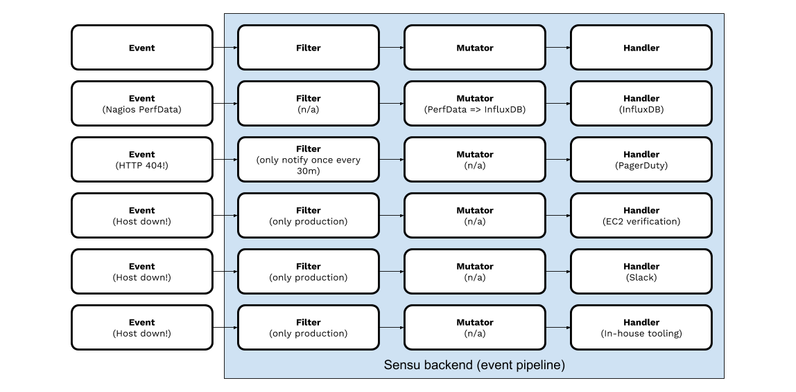
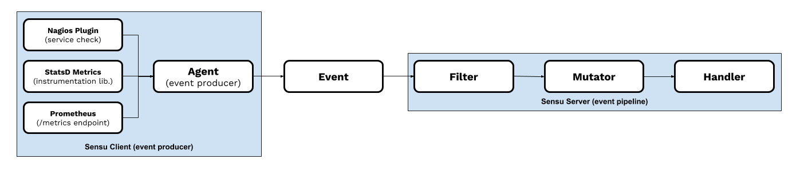

# Monitoring Event Pipeline

## What is Sensu?

Sensu is _the_ cloud native monitoring event pipeline. Get complete visibility
from bare metal to kubernetes &ndash; **every system, every protocol, every
time**. Sensu is the solution to the monitoring problems facing modern
enterprises today, and the right foundation for your organization tomorrow.

### What is a monitoring event pipeline?


### What can you do with a monitoring event pipeline?

Sensu is a framework for hybrid cloud infrastructure and application _monitoring
workflow automation_.

- **Consolidate monitoring tools** (Nagios, synthetics, etc)
- Automate system reliability & **improve SRE retention**
- Automated **compliance monitoring** (inspec, osquery)
- Enterprise monitoring **governance solution**

Here are just a few example workflows:



### What are monitoring events?

Monitoring events are an abstraction for service health information, telemetry
data, discovery, and alerts.

```
{
  "source": "web-server-01",
  "name": "web_service",
  "environment": "production",
  "region": "us-west-1",
  "status": 2,
  "output": "HTTP/1.1 404 Not Found",
  "handlers": ["pagerduty","influxdb"],
  "contacts": ["web_team"]
}
```

### The Sensu Agent &ndash; a powerful event producer

The Sensu Agent provides compatibility with popular and standards-based
interfaces, and converts their outputs into monitoring events that can be
processed by the Sensu backend.

Some example interfaces include Nagios/Icinga/Zabbix plugins, Prometheus
endpoints (exporting Prometheus metrics), StatsD, SNMP, and more.



## Workshop

Enough talk, let's walk through a hands-on workshop. Clone this repository, and
follow along this guide to get started automating your monitoring workflows
today!

### Setup

1. **Sign up for a FREE 30-day trial of Sensu Enterprise**. This workshop is
   based on [Sensu Enterprise][sensu-enterprise], which ships with a number of
   [built-in integrations][sensu-integrations] (i.e. built-in
   [Sensu Handlers][sensu-handlers]) that make things easier for first-time
   Sensu users. To get a Sensu Enterprise repository username and password,
   please visit: https://account.sensu.io/users/sign_up?plan=gold (**no credit
   card required**).

   _NOTE: none of the actual features used in this workshop are unique to Sensu
   Enterprise outside of the built-in Slack and InfluxDB integrations, so this
   same workflow should be possible using Sensu Core (with some slight
   modifications for installing a community Slack and InfluxDB handler, and
   configuring them accordingly). In fact, a workshop based on Sensu Core is
   coming soon, and will be available at https://github.com/sensu/sandbox when
   it is completed._

   [sensu-enterprise]:   https://sensu.io/features/enterprise
   [sensu-integrations]: https://docs.sensu.io/sensu-enterprise/3.1/integrations/
   [sensu-handlers]:     https://docs.sensu.io/sensu-core/1.4/reference/handlers/

2. **Provision the Vagrant box**. The first thing we'll need is a running
   Sensu installation. Replace the `REPLACEME` strings below with your Sensu
   Enterprise repository username and password, and then run `vagrant up`.

   ```
   $ export SE_USER=REPLACEME
   $ export SE_PASS=REPLACEME
   $ vagrant up
   ```

   That's it! You should now have a complete Sensu Enterprise installation
   running locally, with Sensu's API and other ports mapped to your localhost
   address space for further testing beyond this guide. This Vagrant VM also has
   a few extras installed, including [InfluxDB][1] and [Grafana][2], which we
   will use during this workshop.

   _NOTE: installing Vagrant is left as an exercise for the reader; please
   visit [vagrantup.com][3] for more information. This `VagrantFile` provides
   support for the `virtualbox` (default) and `vmware_fusion` [Vagrant
   providers][4]; to use the `vmware_fusion` provider, set the
   `VAGRANT_DEFAULT_PROVIDER` environment variable (i.e. `export
   VAGRANT_DEFAULT_PROVIDER=vmware_fusion`), or indicate the provider using the
   `--provider` flag at provisioning time (i.e. `vagrant up --provider
   vmware_fusion`)._

   [1]: https://influxdata.com
   [2]: https://grafana.com
   [3]: https://vagrantup.com
   [4]: https://www.vagrantup.com/docs/providers/

3. **Connect to the virtual machine**. The remainder of this guide assumes you
   are editing files and executing commands from the Sensu Vagrant VM.

   ```
   $ vagrant ssh
   ```

   References to viewing dashboards (including Sensu and Grafana dashboards;
   e.g. http://localhost:3000) should be accessible from your host system due to
   the above stated port mappings.

   OK &ndash; LET'S HAVE SOME FUN!

### Introducing the Monitoring Event Pipeline

The following guide will walk you through the basic monitoring event pipeline
concepts and prepare you to start configuration your own monitoring workflow
automations using Sensu. The guide starts with a fresh Sensu installation, and
assumes some extra niceties are installed (e.g. the `jq` utility), as provided
for in the Sensu Vagrant VM and installation guide, above.

1. **Configure one or more handlers**. The first thing we need to do with a
   fresh Sensu installation is configure the handlers that will perform the
   actions in our workflows (e.g. sending an email or slack notification).

   For this workshop, we're going to use the Sensu Slack hander. Copy the
   following configuration to a file located at
   `/etc/sensu/conf.d/handlers/slack.json`:

   ```
   {
     "slack": {
       "webhook_url": "REPLACEME",
       "username": "Sensu",
       "icon_url": "http://www.gravatar.com/avatar/9b37917076cee4e2d331a785f3426640",
       "channel": "#demo",
       "timeout": 10
     }
   }
   ```

   _**NOTE**: this might be obvious, but you'll need to replace the text `REPLACEME`
   with a Slack ["Incoming Webhook"][5] URL._  

   Let's also create a second handler for sending telemetry data to InfluxDB.
   Copy the following configuration to a file located at
   `/etc/sensu/conf.d/handlers/influxdb.json`:

   ```
   {
     "influxdb": {
       "host": "127.0.0.1",
       "port": 8086,
       "database": "sensu",
       "username": "admin",
       "password": "admin",
       "api_version": "0.9",
       "tags": {
         "dc": "us-central-1"
       }
     }
   }
   ```

   > **A note about hand-editing JSON files:** Since we're hand-editing JSON
   configuration files, it's usually a good idea to make sure our files are
   valid JSON (i.e. no syntax errors). We can do this pretty easily with a handy
   little utility called `jq`:
   >
   > ```
   > $ cat /etc/sensu/conf.d/handlers/influxdb.json | jq .
   > {
   >   "influxdb": {
   >     "host": "127.0.0.1",
   >     "port": 8086,
   >     "database": "sensu",
   >     "username": "admin",
   >     "password": "admin",
   >     "api_version": "0.9",
   >     "tags": {
   >       "dc": "us-central-1"
   >     }
   >   }
   > }
   > ```
   >
   > If you see nicely formatted JSON output, you're all set! However, if you
   see a message like `parse error: Expected separator between values at line 7,
   column 13` you have an invalid JSON file (e.g. you could be missing a
   quotation mark or a comma, etc); compare your file with the examples we
   provided above and try again.  
   >
   > Do this for both of the `slack.json` and `influxdb.json` files to make sure
   we get things off to a good start. We won't remind you to do this for the
   rest of this tutorial, but it's a pretty good habit to get into. Once you're
   ready to start deploying Sensu into a production environment, you'll probably
   want to use a configuration management solution like [Puppet][6], [Chef][7],
   or [Ansible][8] to manage these files automatically.

   Let's go ahead and reload or restart the Sensu server. You now have a
   pipeline with two workflows, ready to accept incoming events!

   ```
   $ sudo systemctl reload sensu-enterprise
   ```

   [5]: https://slack.com/apps/A0F7XDUAZ-incoming-webhooks
   [6]: https://puppet.com
   [7]: https://chef.io
   [8]: https://ansible.com  

1. **Publish your first event to the pipeline**. Let's publish our first events
   to the pipeline, using `curl` and the [Sensu Results API][9].

   ```
   $ curl -s -XPOST -H 'Content-Type: application/json' \
   -d '{"source": "web-server-01", "name": "web_service", "output": "error!", "refresh": 1, "status": 1}' \
   http://127.0.0.1:4567/results
   ```

   Did you notice? Nothing happened when we published our event, because we
   didn't indicate which workflow we wanted to use to process, or "handle" the
   event!

   Now let's add the `"handlers"` attribute to our event payload and provide one
   or more handlers (i.e. "workflows") to tell our pipeline how to process our
   event:

   ```
   $ curl -s -XPOST -H 'Content-Type: application/json' \
   -d '{"source": "web-server-01", "name": "web_service", "output": "error!", "refresh": 1, "status": 1, "handlers": ["slack"]}' \
   http://127.0.0.1:4567/results
   ```

   Voila! A Slack notification!

   [9]: https://docs.sensu.io/sensu-core/latest/api/results/

1. **Modify behaviors using event attributes**. Let's see what other behaviors
   we can modify. If you take a look at your Sensu dashboard right now (by
   visiting http://localhost:3000/#/clients in your browser), you'll see that
   you have a single entity called `"web-server-01"` in your client registry.
   Let's make things more interesting by sending another event that is
   associated with a different device/system/service, using the `"source"`
   attribute.

   ```
   $ curl -s -XPOST -H 'Content-Type: application/json' \
   -d '{"source": "web-server-02", "name": "web_service", "output": "error!", "refresh": 1, "status": 1, "handlers": ["slack"]}' \
   http://127.0.0.1:4567/results
   ```

   Notice in your dashboard that Sensu has created another "client" (which could
   represent a device, host, compute instance, etc) and associated our event
   with it. However, have you noticed that Sensu doesn't know anything about our
   clients other than the name we've provided? Let's fix that!

1. **Provide context about the systems you're monitoring using discovery
   events**. Let's provide some "client" (host) metadata using the [Clients
   API][10]. This is effectively a "discovery event" (everything is an
   event!).

   ```
   $ curl -s -XPOST -H 'Content-Type: application/json' \
   -d '{"name": "web-server-02", "address": "10.0.2.102", "subscriptions": ["demo"]}' \
   http://127.0.0.1:4567/clients
   ```

   Now see that Sensu has updated our client with the IP address we've provided.
   Because Sensu events are just JSON data, we can decorate our client with as
   much metadata as we want. It is important to note that there are no
   dependencies here that would prevent an event from being processed due to a
   lack of client metadata.

   To further demonstrate the flexibility here, let's add a custom metadata
   property called `"environment"`:

   ```
   $ curl -s -XPOST -H 'Content-Type: application/json' \
   -d '{"name": "web-server-02", "address": "10.0.2.102", "subscriptions": ["demo"], "environment": "production"}' \
   http://127.0.0.1:4567/clients
   ```

   Go ahead and send a few more discovery events to add more details to our
   `"web-server-02"` client to emulate some data you would like to see about
   systems you'll use Sensu to monitor (e.g. `"store-id": 1234`, or how about
   `"manufacturer": "arista"` and `"model": "7516R"`).

   _NOTE: please do not send any discovery events for `"web-server-01"` at this
   time. Later on in this tutorial we will expect for `"web-server-01"` to be
   **missing** the `"environment": "production"` attribute. Spoiler alert!_

   [10]: https://docs.sensu.io/sensu-core/latest/api/clients/

1. **Publish service recovery events**. Now let's send some events to indicate
   that both of our services have restored and are now healthy.

   ```
   $ curl -s -XPOST -H 'Content-Type: application/json' \
   -d '{"source": "web-server-01", "name": "web_service", "output": "ok!", "refresh": 1, "status": 0, "handlers": ["slack"]}' \
   http://127.0.0.1:4567/results
   $ curl -s -XPOST -H 'Content-Type: application/json' \
   -d '{"source": "web-server-02", "name": "web_service", "output": "ok!", "refresh": 1, "status": 0, "handlers": ["slack"]}' \
   http://127.0.0.1:4567/results
   ```

   _NOTE: Sensu events conform to the familiar and proven convention introduced
   by Nagios: `0` = "Healthy", `1` = Warning, and `2` = Critical._

1. **Publish telemetry events**. Let's try sending some performance data (i.e.
   "metrics") in an event, and let's process this data using our "influxdb"
   handler (to send the metrics to the InfluxDB time series database, or
   "TSDB"). To start, let's send the metric data using the [InfluxDB Line
   Protocol][11].

   Almost all TSDB formats expect metric data points in plain text strings. For
   the InfluxDB Line Protocol that string contains a measurement name (e.g.
   `weather`), followed by a space, then any number of "field=value" pairs,
   separated by commas (e.g. `temperature=82,humidity=0.65`), followed by
   another space, then finally a timestamp in seconds since Unix epoch (e.g.
   `1531371504`).  

   ```
   weather temperature=82,humidity=0.65 1531371504
   ```

   ```
   $ curl -s -XPOST -H 'Content-Type: application/json' \
   -d '{"source": "web-server-02", "name": "web_service_response", "output": "web_service value='`echo $RANDOM`' '`date +%s`'", "refresh": 1, "status": 0, "type": "metric", "output_format": "influxdb_line", "handlers": ["influxdb"]}' \
   http://127.0.0.1:4567/results
   ```

   > **HUH?**: in case you are looking at this event and scratching your head,
   this sidebar is for you. For our tutorial, we're using a few basic Bash shell
   tricks to generate an InfluxDB Line Protocol compatible metric, and wrapping
   it in a Sensu Event compatible JSON data payload. For our workshop, we're
   creating a metric with the measurement name `web_service` and a value called
   `value`. To generate dynamic results we'll use the [`$RANDOM` environment
   variable][12] to return a random value between 0 and 32767. Finally, to
   generate our timestamp we'll use the [`date` command][13], with the `%s`
   format (i.e. `date +%s`, which outputs "seconds since 1970-01-01 00:00:00
   UTC"). You can recreate this output by running this command on basically any
   linux system in the world:
   >
   > ```
   > $ echo 'web_service value='`echo $RANDOM`' '`date +%s`
   > web_service value=7835 1531372345
   > ```
   >
   > In the real world you probably won't and/or shouldn't be sending metrics
   from a bash script, but in case you ever do, **it will totally work**! It
   will just need to look something like this. :)  

   [11]: https://docs.influxdata.com/influxdb/v1.6/write_protocols/line_protocol_tutorial/
   [12]: http://tldp.org/LDP/abs/html/randomvar.html
   [13]: http://man7.org/linux/man-pages/man1/date.1.html


1. **Modify the behavior of the pipeline with Event Filters**. In the real world
   you wouldn't expect to handle every single event in the same way. For
   example, you wouldn't expect to get repeat notifications every 10 seconds
   letting you know a service is down.  

   Copy the following configuration to a file located at:
   `/etc/sensu/conf.d/filters/production_only.json`:

   ```
   {
     "filters": {
       "production_only": {
         "negate": false,
         "attributes": {
           "client": {
             "environment": "production"
           }
         }
       }
     }
   }
   ```

   Now we must configure our handler to use this filter. Update your handler
   configuration file as follows (adding the `"filters": ["production_only"]`
   line; and be sure to check that your file is valid JSON!):

   ```
   {
     "slack": {
       "webhook_url": "REPLACEME",
       "username": "Sensu",
       "icon_url": "http://www.gravatar.com/avatar/9b37917076cee4e2d331a785f3426640",
       "channel": "#demo",
       "timeout": 10,
       "filters": ["production_only"]
     }
   }
   ```

   Reload or restart the Sensu server to pick up the updated configuration:

   ```
   $ sudo systemctl reload sensu-enterprise
   ```

   Now let's publish those same events we published at the beginning of our
   tutorial (for `"web-server-01"` and `"web-server-02"`). Notice that these are
   identical events, but only one of them will get handled/processed (i.e. only
   one of them will result in a Slack notification):

   ```
   $ curl -s -XPOST -H 'Content-Type: application/json' \
   -d '{"source": "web-server-01", "name": "web_service", "output": "error!", "refresh": 1, "status": 1, "handlers": ["slack"]}' \
   http://127.0.0.1:4567/results
   $ curl -s -XPOST -H 'Content-Type: application/json' \
   -d '{"source": "web-server-02", "name": "web_service", "output": "error!", "refresh": 1, "status": 1, "handlers": ["slack"]}' \
   http://127.0.0.1:4567/results
   ```

   Did you notice? You should have received a Slack notification for
   `"web-server-02"`, but not for `"web-server-01"`. This means our filter
   worked! From now on, you'll only receive Slack notifications for events
   coming from the production environment.

   > PROTIP: The coolest thing about this is that this `"environment"` attribute
   isn't part of the Sensu event specification &ndash; in other words it's not a
   built-in attribute that Sensu expects; it's just a custom JSON
   attribute &ndash; so we can leverage any number of custom attributes in
   filters.  

   Now let's update `"server-01"` with the `"environment": "production"`
   attribute using a discovery event, so that we can get alerts from this client
   again:

   ```
   $ curl -s -XPOST -H 'Content-Type: application/json' \
   -d '{"name": "web-server-01", "address": "10.0.2.101", "subscriptions": ["demo"], "environment": "production"}' \
   http://127.0.0.1:4567/clients
   ```

   Now when we publish events for `"web-server-01"` we should get notified in
   Slack:

   ```
   $ curl -s -XPOST -H 'Content-Type: application/json' \
   -d '{"source": "web-server-01", "name": "web_service", "output": "error!", "refresh": 1, "status": 1, "handlers": ["slack"]}' \
   http://127.0.0.1:4567/results
   ```

   Success!

Congratulations! You have completed our simple Monitoring Event Pipeline
tutorial. So far we've just covered the basics: events, filters, and handlers.
To learn more &ndash; including primitives like mutators and aggregates &ndash;
please visit the Sensu reference documentation.

Now let's continue to learn about how we can automate many of the steps we
worked through in our tutorial by using the Sensu Agent.

### Introducing the Sensu agent (`sensu-client`)

The Sensu agent is an automated event producer. It takes care for things like
automated discovery, scheduling monitoring check executions, and converting
outputs of popular monitoring tools into events. It also provides a local
endpoint for routing events back to the event pipeline.

1. **Install and configure your first Sensu agent**. Let's install the open
   source Sensu agent:

   ```
   $ sudo yum install -y sensu
   ```

   Let's configure our client by copying the following configuration to a file
   located at `/etc/sensu/conf.d/client.json`:

   ```
   {
     "client": {
       "name": "web-server-01",
       "environment": "production",
       "socket": {
         "bind": "0.0.0.0",
         "port": 3030
       },
       "subscriptions": [
         "demo",
         "webserver"
       ]
     },
     "transport": {
       "name": "redis",
       "reconnect_on_error": true
     },
     "redis": {
       "host": "127.0.0.1",
       "port": 6379
     }
   }
   ```

   > _WHAT IS THE SENSU TRANSPORT? The Sensu services (i.e. `sensu-enterprise`
   and `sensu-client`) don't actually communicate directly with each other; they
   do so via a message bus or `"transport"`. The default [Sensu Transport][14]
   is RabbitMQ, but Redis is also supported and that's what we're using here._

   Now we just need to start the agent:

   ```
   $ sudo systemctl start sensu-client
   ```

   If you look at your Sensu dashboard again (http://127.0.0.1:3000) you'll
   notice that the Sensu client is now sending discovery events for us (e.g. see
   the updated IP Address, and other attributes from the `"client"` scope of our
   config file, above)! Now if we want to update metadata about our hosts, we
   can manage it with a configuration file instead of sending data to the HTTP
   API.

   [14]: https://docs.sensu.io/sensu-core/latest/reference/transport/#reference-documentation

1. **Publishing events to the agent socket.** Let's send that same/original
   event payload from step 1 to our pipeline using the Sensu agent socket:

   ```
   $ echo '{"source": "web-server-01", "name": "web_service", "output": "error!", "refresh": 1, "status": 1, "handlers": ["slack"]}' | nc localhost 3030
   ```

   ...now let's remove the `"source"` attribute and see what happens. The Sensu
   agent automatically decorates our events with its local metadata.

   ```
   $ echo '{"name": "web_service", "output": "hello world!", "refresh": 1, "status": 1, "handlers": ["slack"]}' | nc localhost 3030
   ```

   Using the Sensu agent means your applications don't need to know where they
   are running - they can just publish events to a local socket!

1. **Configuring our first automated event producer**. Let's install a service
   and a plugin to monitor this service, and have Sensu monitor it on a 10
   second interval.

   ```
   $ sudo yum install -y nginx nagios-plugins-http
   ```

   Let's start Nginx and make sure it is up and running.

   ```
   $ sudo systemctl start nginx
   $ curl -I http://localhost:80
   ```

   Now let's use the Nagios `check_http` plugin to check our local web service:

   ```
   $ /usr/lib64/nagios/plugins/check_http -H localhost -N
   ```

   > SIDEBAR: At this point, if we really wanted to avoid using the Sensu agent, we
   could write a little wrapper to run this check as a cron job, and send Nagios
   check results (i.e. events) to the Sensu Results API. It could look something
   like this:
   >
   > ```
   > $ curl -s -XPOST -H 'Content-Type: application/json' \
   > -d '{"source": "web-server-01", "name": "web_service", "output": "'`/usr/lib64/nagios/plugins/check_http -H localhost -N`'", "refresh": 1, "status": '`echo $?`', "handlers": ["slack"]}' \
   > http://127.0.0.1:4567/results
   > ```
   >
   > This would work, but we're not recommending it.

   Let's use Sensu to schedule this check to run every ten seconds. We'll use
   the Sensu server and agent together to solve this problem. Copy the following
   configuration to a file located at
   `/etc/sensu/conf.d/checks/check_http.json`:

   ```
   {
     "checks": {
       "web_service": {
         "command": "/usr/lib64/nagios/plugins/check_http -H localhost -N",
         "interval": 10,
         "subscribers": ["webserver"],
         "type": "metric",
         "handlers": ["slack","influxdb"],
         "output_format": "nagios_perfdata"
       }
     }
   }
   ```

   Now let's reload our server configuration and let Sensu do the rest:

   ```
   $ sudo systemctl reload sensu-enterprise
   ```

   **Look ma! No hands!** At this point Sensu should be monitoring your locally
   running HTTP service (a default Nginx server), and will notify you via Slack
   if/when it detects a failure.  

   > _DID YOU NOTICE? We didn't have to reload our Sensu agent configuration, but
   the checks are starting to get scheduled and executed. This is because the
   Sensu server (i.e. `sensu-enterprise`) is publishing this request to the
   `"webserver"` subscription (i.e. a message bus "topic" or "channel") that the
   Sensu agent is subscribed to (see the `client.json` file we configured
   together, above)._

## Next Steps

Thank you for your time in working through this guide and learning more about
Sensu, the Monitoring Event Pipeline. At this point we've covered enough topics
to give you a general sense of how Sensu works, but we've only really scratched
the surface. If you're interested in continuing your evaluation of Sensu, please
consider the following:

- **Join the Sensu Community!** Join the discussion on Slack and meet other
  Sensu users by visiting [https://slack.sensu.io][15].

  [15]: https://slack.sensu.io

- **Occurrence filtering**. We're sure you've noticed by now that Sensu is
  sending notifications to Slack for _every occurrence_ of an event. This is
  just about the worst case scenario for a modern monitoring solution, but it
  was intentional for the purposes of our tutorial/workshop. Because we were
  using Sensu Enterprise for this exercise, which has a [built-in occurrence
  filter][16], we were explicitly disabling occurrence filtering by setting the
  `"refresh": 1` attribute in our events (telling Sensu how often to "refresh"
  the occurrence counter; i.e. "notify on every 1 new occurrence").

  The [Sensu Filters][17] reference documentation provides a working example of
  occurrence filtering that can you can use as a helpful next step here.

  [16]: https://docs.sensu.io/sensu-enterprise/latest/filters/handle-when/
  [17]: https://docs.sensu.io/sensu-core/latest/reference/filters/#example-handling-repeated-events

- **Add more/remote Sensu agents**. The configuration provided by this workshop
  has the Sensu backend (`sensu-enterprise`) and the Sensu agent process
  (`sensu-client`) running on the same system. In order to start getting value
  out of Sensu you may need to deploy Sensu agents on remote systems.

  The Sensu [installation guide][18] provides a helpful reference for installing
  and configuring the Sensu agent on additional systems.

  [18]: https://docs.sensu.io/sensu-core/latest/installation/install-sensu-client/

- **Reference & API documentation**. For more information on Sensu's complete
  capabilities, please review the [reference documentation][19] and [API
  reference][20]. Some

  [19]: https://docs.sensu.io/sensu-core/latest/reference/
  [20]: https://docs.sensu.io/sensu-core/latest/api/overview/
