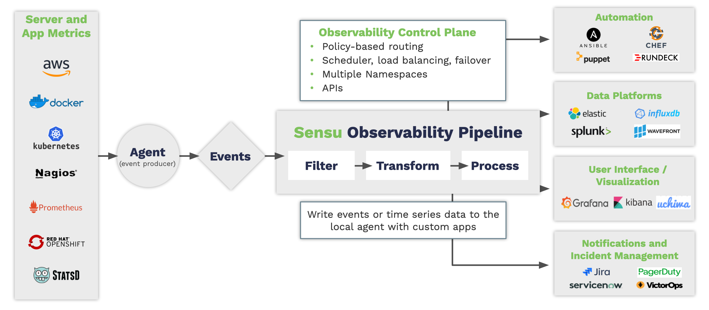

# Lesson 1: Introduction to Sensu

- [Goals](#goals)
- [Observability Pipeline](#observability-pipeline)
- [How Does Sensu Work?](#how-does-sensu-work)
  - [Sensu Data Model](#sensu-data-model)
- [Monitoring As Code](#monitoring-as-code)
  - [Sensu is an API, Configurations are YAML](#sensu-is-an-api-configurations-are-yaml)
  - [Bonsai Asset Repository](#bonsai-asset-repository)
- [Discussion](#discussion)
- [Learn More](#learn-more)
- [Next Steps](#next-steps)

## Goals
In this lesson we will introduce the Sensu observability pipeline. You will learn about Sensu's architecture, its underlying data model, and how its unique set of features can be used to implement a monitoring-as-code solution.

This lesson is intended for operators of Sensu, or anyone who would like a short semi-technical introduction to Sensu.

## Observability Pipeline

There as many approaches to monitoring as there are software applications written. 
Perhaps more. 
Some are assembled from a mish-mash of glued-together services.
Others are monolithic commercial platforms that attempt to do everything from polling the kernel, to storing each log line and every millisecond of system metrics, into massive vendor-specific data lakes. 

Sensu takes a middle path in this milieu by providing a smooth pathway for observations to flow directly from their origins to any number of destinations. 
Using a flexible API-oriented approach, Sensu pipelines can chain many event-processing components together, in a model similar to UNIX pipes. 
These components filter, modify, and route the data, producing alerts, storing metrics, triggering automated remediations, and much more.



## How Does Sensu Work?
Within Sensu, everything starts with the _agent_. 
An agent is a [sidecar process][sidecar_process] deployed alongside your code, which observes your running systems.
It publishes _events_ which pass through a customized pipeline that filters, modifies, and makes decisions about how to handle the events. 
Most importantly it uses the same kinds of conditional logic that you do.

- "Does this event mean the whole system is down? If so, send an alert to PagerDuty, and to Slack."
- "This event shows that the system is working again. Let's resolve that previous incident, and send an all-clear message to Slack. Also, stop storing metrics until another incident occurs." 
- "Hmm.. these events seem related to our current marketing campaign. I bet they would be interesting to run some stats reports on. Let's filter them out and store in a time-series database for later analysis."

### Sensu Data Model

Sensu provides an _integrated_ pipeline with a _consistent_ data model. 
Operating like a control-plane, Sensu gives you a flexible means by which to direct multiple streams of observations and metrics to whatever destination you need them to go, and transforms them into whatever shape they need to be along the way.

It can do this because every observation in Sensu is contained in a single flexible data structure; the _event_.

**Example: A Sensu Event Data Structure**
```json
{
  "metadata": {},
  "entity": {},
  "check": {},
  "metrics": {},
  "id": "xxxxxxxx-xxxx-xxxx-xxxx-xxxxxxxxxxxx",
  "timestamp": 1234567890
}
```

Events can contain numeric metrics, dictionaries of metadata, labels, and annotations, as well as any other payload of information that is meaningful to your system.
Each component in the pipeline expects a stream of events as input and outputs a stream to the next component.

Learn more about the event data structure in the [events reference docs](https://docs.sensu.io/sensu-go/latest/observability-pipeline/observe-events/events/)

## Monitoring as Code

There is a strong movement towards managing all aspects of the software industry in the same way that we manage application code. 
Collectively these are referred to as "everything-as-code" methods.

Sensu is designed specifically to enable this kind of workflow for monitoring.

### Sensu is an API, Configurations are YAML

The Sensu _backend_ is a service that provides the API and performs event processing.
All aspects of the observability pipeline can be modified at runtime through the API. 
Operators can add new components, modify the behavior of filters and handlers, silence noisy streams of data, or add new database sinks *at any time*, without the need to re-deploy.

Components are defined in YAML files, which are pushed to the API to build the pipeline.
These YAML files can be stored in source-control alongside your application code, and can be tested, versioned, and managed like any other code file.
This workflow takes the burden off of system operators, by allowing engineers to self-service their monitoring configurations, with security and access controls at every layer.

To learn more, please check out our [monitoring as code whitepaper](https://sensu.io/resources/whitepaper/monitoring-as-code-with-sensu).

### Bonsai Asset Repository

Another essential component of Sensu is the [Bonsai Asset Repository](https://bonsai.sensu.io/).
This service delivers binary assets directly to the agents and the backend, based on the configurations defined in YAML.
Operators and developers can focus only on the YAML configuration, without worrying about how to securely deliver new executables to the edge.

There are hundreds of open-source plugins available on Bonsai, supporting nearly every imaginable integration. 
[Have a look around](https://bonsai.sensu.io/assets)! 
If what you need isn't already available, the [Sensu Plugin SDK](https://github.com/sensu/sensu-plugin-sdk) makes it easy to develop and publish new custom plugins.

## Discussion

In this lesson we covered the basics of Sensu's architecture, data model, and monitoring-as-code workflow. 
The rest of the workshop is a series of hands-on exercises that walk you through some of the essential features of Sensu, in a sandboxed environment.

### All You Have to Think About is `sensuctl` and YAML

The description above might seem somewhat complicated. 
But the beauty of Sensu is that these features are built into the platform, so you don't have to worry about them. 

As an operator, the majority of your time is spent editing YAML, and running high-level commands from a command-line shell.
The Sensu user-experience is simple, consistent, and makes it easy to manage complex environments without being overwhelmed with details.

### How Does this Compare to Your Previous Monitoring System?

Sensu is designed to be an ideal balance between flexibility and structure.

As an intellectual exercise, consider the following questions about your previous monitoring system:
- What monitoring workflows did it support and how did it implement them?
- What did it make easy, and what blind-spots did it have?
- Which of those things are important to your organization? 
- Why did you switch to Sensu?

## Learn More

- [[Whitepaper] "Monitoring as code with the Sensu Observability Pipeline" (sensu.io)](https://sensu.io/resources/whitepaper/monitoring-as-code-with-sensu)
- [[Blog Post] "Monitoring as Code: What It Is and Why You Need It" (sensu.io)](https://sensu.io/blog/monitoring-as-code-what-it-is-and-why-you-need-it)
- [[Documentation] "Sensu Observability Pipeline" (docs.sensu.io)](https://docs.sensu.io/sensu-go/latest/observability-pipeline/)
- [[Blog Post] "The Observability Pipeline" (bravenewgeek.com)](https://bravenewgeek.com/the-observability-pipeline/)
- [[Blog Post] "Observability Pipelines: Why you need one, and why you should stop rolling your own" (sensu.io)](https://sensu.io/blog/observability-pipelines-why-you-need-one-and-why-you-should-stop-rolling-your-own)
- [[Blog Post] "Monitoring as code with Sensu Go and SensuFlow" (sensu.io)](https://sensu.io/blog/monitoring-as-code-with-sensu-flow)

## Next Steps

[Share your feedback on Lesson 01](https://github.com/sensu/sensu-go-workshop/issues/new?template=lesson_feedback.md&labels=feedback%2Clesson-01&title=Lesson%2001%20Feedback)

[Lesson 2: Setup Workshop Sandbox](../02/README.md#readme)


[sidecar_process]: https://docs.microsoft.com/en-us/azure/architecture/patterns/sidecar

