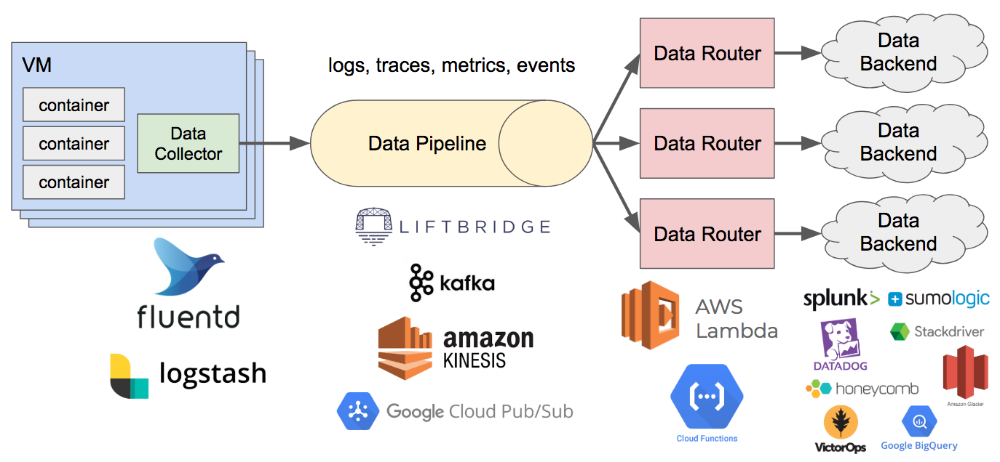
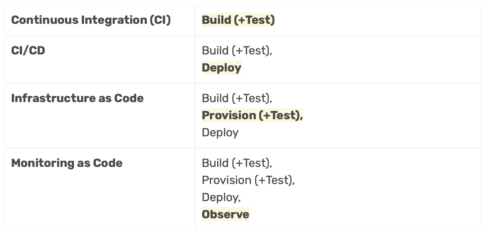
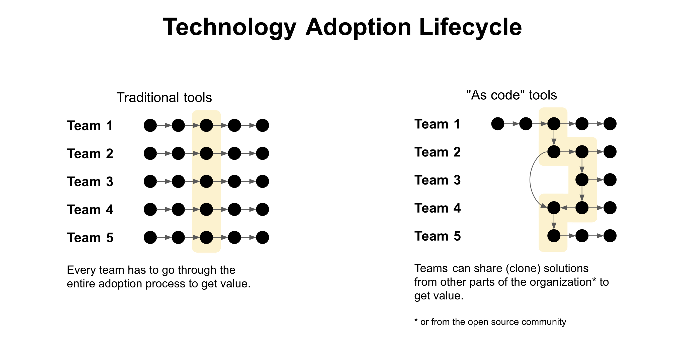

# Lesson 1: Introduction to Monitoring as Code

- [What is Monitoring as Code?](#what-is-monitoring-as-code)
- [What is Observability?](#what-is-observability)
- [What is an Observability Pipeline?](#what-is-an-observability-pipeline)
- [Use cases](#use-cases)
- [Architecture](#architecture)
- [Learn more](#learn-more)
- [Next steps](#next-steps)

## Overview

The following guide will walk you through the basic concepts behind monitoring as code and the observability pipeline, and it will prepare you to start configuration your own monitoring and observability solutions using Sensu.
The guide starts with a fresh Sensu installation, and assumes certain companion services are available (e.g. a data platform such as Prometheus, TimescaleDB, InfluxDB, Elasticsearch, or Splunk; and a graphing solution such as Grafana, Kibana, or Splunk's built-in dashboards).

Multiple reference architectures will be provided for use with this workshop.
Please consult [SETUP.md](/SETUP.md) for more information.

## What is Monitoring as Code?

Monitoring as code is the natural progression of the "everything as code" movement, and a critical component of "as code" initiatives.
Adopting monitoring as code means extending the cultural expectations around repeatability, safety, and velocity in application development and infrastructure automation to monitoring and observability.
The way we observe and operate our systems after they are deployed should be managed the same way we build, test, and deploy those same systems: as code.

As such, a true monitoring as code solution goes beyond simply automating installation of agents, scrapers, and plugins – it is a complete end-to-end solution.
Monitoring as code should provide code-based management for every component of the monitoring and observability stack:

- **Instrumentation**

  Automated installation of plugins and exporters.

- **Scheduling**

  Centralized management of real-time data collection.

- **Automated Diagnosis**

  Orchestration of codified diagnosis; e.g. what additional context may be needed in the event that an anomaly is detected (i.e. automation of the assessment an operator would perform to triage an incident).

- **Evaluation & Detection**

  Correlation and deduplication of observability data.

- **Notification**

  Alerts & incident management.

- **Processing & Analysis**

  Metric and event storage and analysis.

- **Automated Remediation**

  Orchestration of codified remediation actions – not just forwarding raw events to a correlation engine.

The key difference between traditional monitoring workflows and monitoring as code can be distilled down to a single concept: what we do with monitoring and observability data is even more important than how we collect it.

To learn more, please check out our [monitoring as code whitepaper](https://sensu.io/resources/whitepaper/monitoring-as-code-with-sensu).

## What is Observability?

Observability is set of practices that include traditional monitoring (i.e. observability is a superset of monitoring).
The term originated in the discipline of control systems engineering, where it is defined as a measurement of how well a system's internal states could be inferred from its external outputs.
A system is observable if its current state can be determined in a finite time period using only the outputs of the system.
Observability is achieved by collecting and analyzing events, logs, metrics, and trace data from the systems we operate.

> _NOTE: Defining the terms "monitoring" and "observability" are non-goals for this workshop.
> However, a lot has been written on this topic and some of our favorite opinions on the matter are linked in the ["Learn more"](#learn-more) section, below._

## What is an Observability Pipeline?

An observability pipeline is a solution for stream processing all types of observability data.
Observability pipelines ["decouple the collection of observability data from the ingestion of that data into a variety of systems [of record]"](https://bravenewgeek.com/the-observability-pipeline/) (e.g. data platforms and incident management systems).
In doing so, observability pipelines ensure that critically valuable observability data isn't locked up inside a single vendor solution provide granular controls for when, where, and how observability data can be processed.

While simple in concept, observabilty pipelines can be quite complex to build in practice.

_FIGURE 1: a generic/conceptual observability pipeline ([source](https://bravenewgeek.com/the-observability-pipeline/))._

If the pseudo architecture diagram (or "markitecture diagram") looks a little bit like a [Rube Goldberg machine](https://en.wikipedia.org/wiki/Rube_Goldberg_machine), that's effectively what all DIY observabilty pipelines become, sooner or later.
Thankfully, you don't need to cobble together collection of services to adopt an observability pipeline – Sensu Go is a turn-key observabilty pipeline that enables monitoring as code on any cloud.

_FIGURE 2: Sensu's turn-key solution enables organizations to adopt observability pipelines with ease._

## Why Sensu?

What does "monitoring as code" and the "observability pipeline" have to do with eachother?
And how is Sensu's solution better than the alternatives (including the DIY pipeline)?
This question is answered in our [monitoring as code whitepaper](https://sensu.io/resources/whitepaper/monitoring-as-code-with-sensu) (bold added for emphasis):

> Everything as code initiatives as we know them are built on top of **pipelines that enable organizations to codify complex business requirements as repeatable steps**.
> The CI pipeline (build+test) paved the way for Continuous Delivery (CD).
> Together as the CI/CD pipeline (build+test, deploy), they provided the foundation for infrastructure as code (build+test, provision+test, deploy).
> Like IaC, monitoring as code hooks into this CI/CD pipeline, but also requires a dedicated pipeline for ongoing observation of our systems (build+test, provision+test, deploy, observe).
> We call this missing link the observability pipeline.
>
> 

Simply shoving observability data through a pipeline where you can filter and route it to various backends is a great first step in an observability pipeline journey – but how to you manage the overall solution?
And how do you onboard new users – including teams with a multitude of disparate tools spanning multiple generations of technology?
Sensu's observability provides a centralized control plane and end-to-end solution for monitoring as code, which enables organizations to onboard workloads to the observability pipeline in an incremental manner.

_FIGURE 3: the "as code" technology adoption lifecycle._

## Use cases

Sensu's observability pipeline

- **Eliminate data silos**

  By decoupling data collection from storage and analysis, Sensu enables you to consolidate data into data platforms like Elasticsearch, Splunk, and Sumo Logic.

- **Fill gaps between existing monitoring and observability tools**

  No one monitoring or observabilty tool can do it all, yet the proliferation of tools can in itself be a burden.
  Adopting an observability pipeline eliminates the risks typically inherent to tool sprawl (e.g. data silos).

- **Consolidate monitoring tools**

  Sensu supports your existing monitoring plugins and exporters – including Nagios-style monitoring scripts, StatsD, Telegraf, Prometheus – as well as hundreds of Sensu native integrations.

- **Automate diagnosis & self-healing**

  Sensu provides built-in solutions for automated diagnosis (collecting additional context to enrich observabilty data), and automated remediation – plus integration with automation platforms like Rundeck or Ansible Tower, and more.

## Architecture

==COMING SOON==

## Learn more

- [[Whitepaper] Monitoring as code with the Sensu observability pipeline](https://sensu.io/resources/whitepaper/monitoring-as-code-with-sensu)
- [Monitoring as Code: What It Is and Why You Need It (thenewstack.io)](https://thenewstack.io/monitoring-as-code-what-it-is-and-why-you-need-it/)
- [What is Observability? (sumologic.com)](https://www.sumologic.com/glossary/observability/)
- [Monitoring and Observability (by Cindy Sridharan)](https://copyconstruct.medium.com/monitoring-and-observability-8417d1952e1c)
- [Sensu Observability Pipeline (user documentation)](https://docs.sensu.io/sensu-go/latest/observability-pipeline/)

## Next steps

[Lesson 2: Introduction to the Observability Data Model](../02/README.md#readme)
