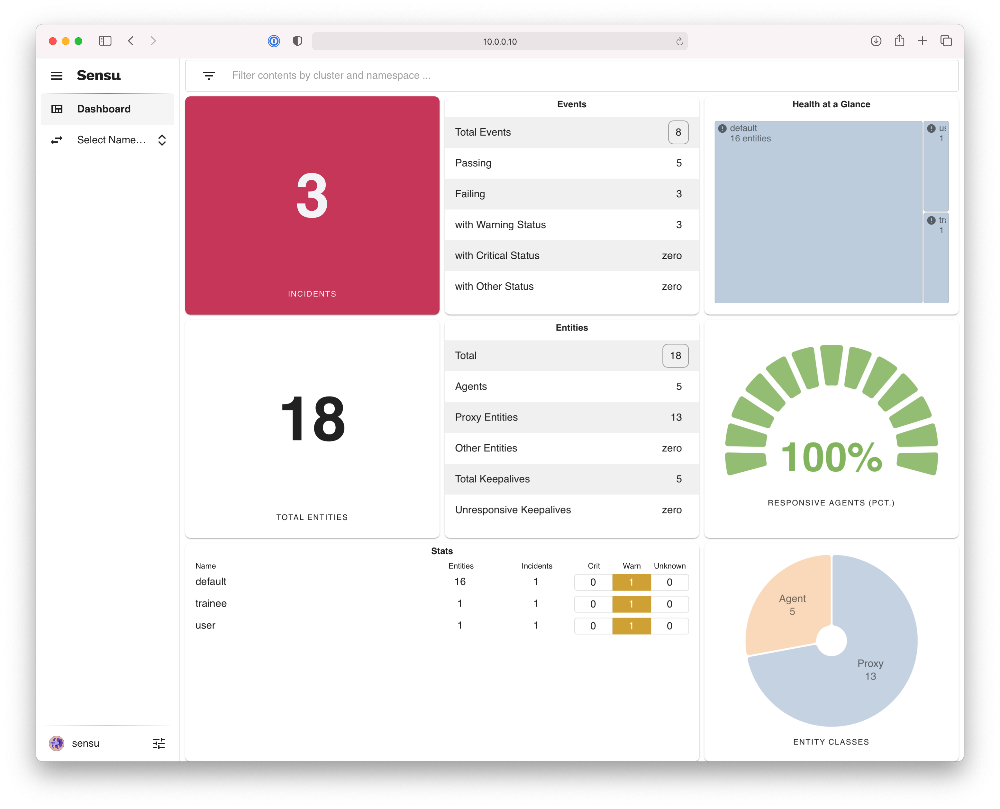
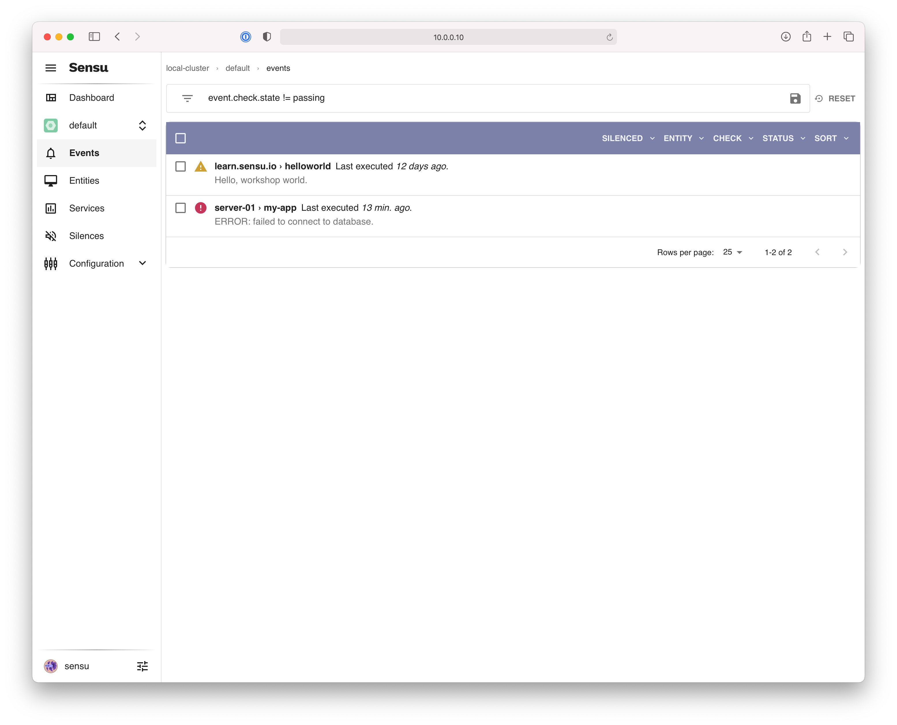
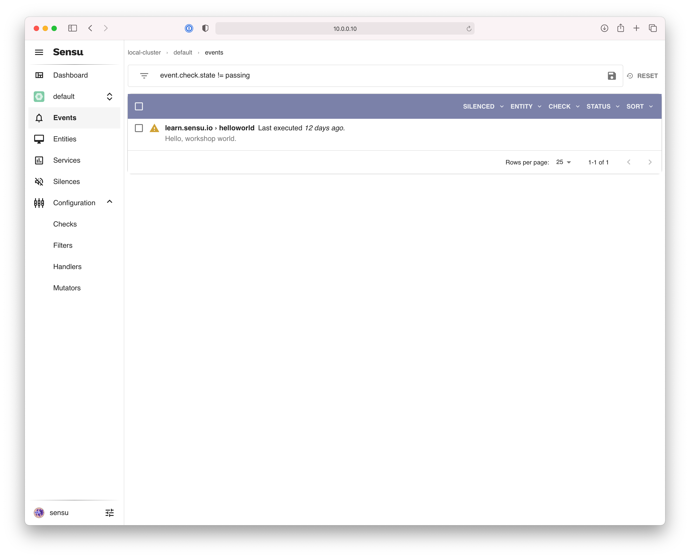
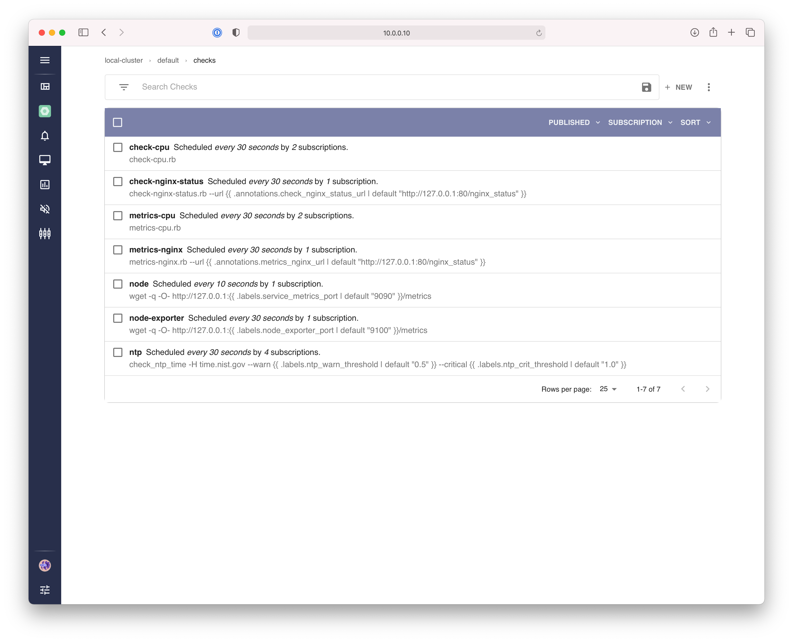
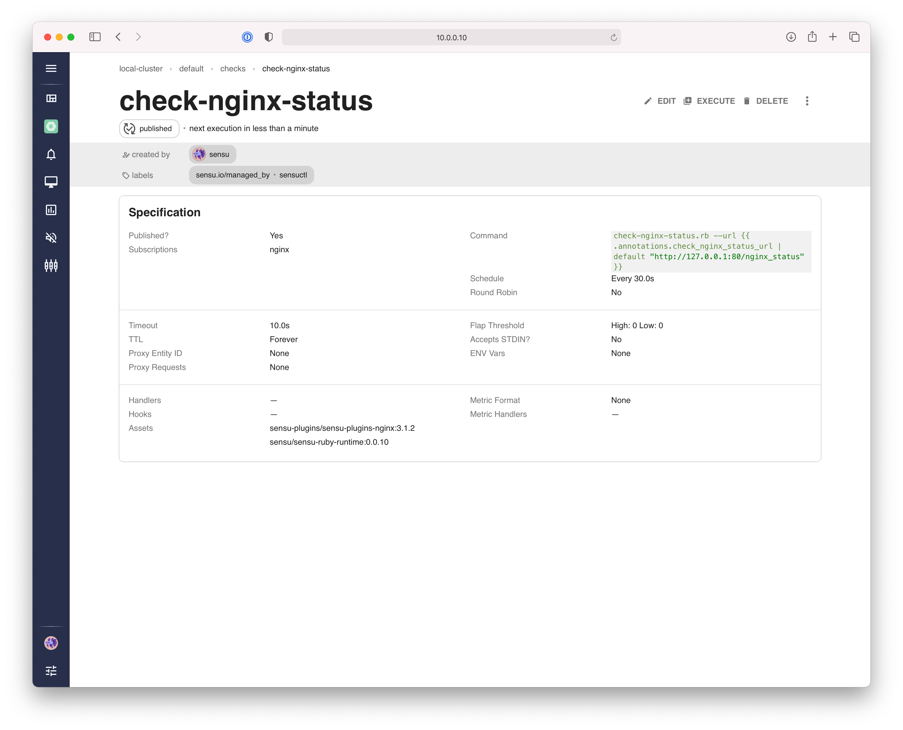

# Lesson 3: Introduction to Sensu Go

- [Web App](#web-app)
  - [Dashboard](#dashboard)
  - [Namespaces switcher](#namespaces-switcher)
  - [Event list & event detail views](#event-list--event-detail-views)
  - [Entity list & entity detail views](#entity-list--entity-detail-views)
  - [Silencing](#silencing)
  - [Configuration](#configuration)
- [EXERCISE 1: log in to the Sensu web app](#exercise-1-log-in-to-the-sensu-web-app)
- [Command Line Interface (CLI)](#command-line-interface--cli)
  - [API client](#api-client)
  - [Configuration management](#configuration-management)
  - [Inventory](#inventory)
  - [Output formats](#output-formats)
  - [Interactive and non-interactive modes](#interactive-and-non-interactive-modes)
- [EXERCISE 2: install and configure `sensuctl`](#exercise-2-install-and-configure-sensuctl)
- [EXERCISE 3: use the `sensuctl --help` command](#exercise-3-use-the-sensuctl---help-command)
- [EXERCISE 4: inspect an event in JSON format](#exercise-4-inspect-an-event-in-json-format)
- [EXERCISE 5: explore Sensu resources using `sensuctl`](#exercise-5-explore-sensu-resources-using-sensuctl)
- [EXERCISE 6: create an API Key for personal use](#exercise-6-create-an-api-key-for-personal-use)
- [EXERCISE 7: export Sensu resources using `sensuctl dump`](#exercise-7-export-sensu-resources-using-sensuctl-dump)
- [Learn more](#learn-more)
- [Next steps](#next-steps)

## Web App

The Sensu backend process includes a web app that provides a unified view of your observability data (events, entities, and silences) and monitoring configuration (checks, handlers, etc) with user-friendly tools to reduce alert fatigue.

### Dashboard

The Sensu web app homepage is a dashboard that provides a high level overview of the overall health of the systems under management by Sensu.
The dashboard includes a summary of active incidents, a breakdown of incidents by severity, information about entities under management, and a high level overview of the namespaces (tenants).
This dashboard complies with Sensu RBAC, so individual users will see summary information relevant to their access.


_**Figure 1:** the Sensu dashboard._

### Namespaces switcher

Beyond the overview dashboard, most Sensu data is accessed on a per-namespace basis.
To select or switch namespaces, press the "Select Namespace" option from the sidebar, or press the `Control + k` keyboard shortcut from anywhere in the Sensu web app.


_**Figure 2:** the namespace switcher._



_**Figure 3:** the "Select Namespace" option in the navigation sidebar._

### Event list & event detail views

The default view that will be opened when navigating to a namespace is the event list view.
A filter is applied to this view by default to show only events with a "non-passing" status (i.e. `event.check.state != 0-`).
The event list view provides a number of options for filtering and sorting the list by event status, related entities, and more.
Select one or more events in the event list view to take bulk actions like resolving or silencing the event(s).



_**Figure 4:** the event list view.
Note the default filter applied here (`event.check.state != 0`)._

Selecting an event from the event list view will take you to the event detail view, which provides information about the event including the status, timeline, output, number of occurrences, event metadata (labels and annotations), related check configuration (if the event was produced by a service check), and the associated entity details.


_**Figure 5:** the event detail view._

### Entity list & entity detail views

The second most popular view in the Sensu web app is the entity list view, which provides realtime inventory information of endpoints under management by Sensu (for a given namespace).
Select one or more events in the event list view to take bulk actions like resolving or silencing the event(s).


_**Figure 6:** the entity list view._

Selecting an entity from the entity list view will take you to the entity detail view, which provides information about all associated events, system properties (e.g. operating system details and network interfaces), and entity metadata (labels and annotations).


_**Figure 7:** the entity detail view.
Note that the "Events" tab is selected by default._

### Silencing

Users can use the Sensu web app to silence individual events (for a single entity), all events produced by a specific check (across multiple entities), or all events for a specific entity.
Silencing may be applied from various different locations in the Sensu web app, with prompts to configure the silencing rules (which check and/or entity should be silenced), schedule (e.g. to begin immediately, or create a "scheduled maintenance" window), and reason.


_**Figure 8:** the "new silencing entry" prompt._

The Silences list view provides access to all active silence entries.


_**Figure 9:** the silenced list view._

### Configuration

The Sensu web app also provides access to the core monitoring configuration, including Checks, Fitlers, Mutators, and Handlers.
The configuration views may be accessed from the navigation sidebar.
Each of the configuration resources provides list + detail views, as well as the ability to create and/or edit configuration resources (e.g. modify check or handler configuration), assuming the user has the appropriate RBAC permissions.



_**Figure 10:** monitoring configuration views are accessible via the navigation sidebar._



_**Figure 11:** the check list view.
A similar view is available for Filters, Mutators, and Handlers._



_**Figure 12:** the check detail view.
A similar view is available for Filters, Mutators, and Handlers._


_**Figure 13:** the check edit view.
A similar editor is available for Filters, Mutators, and Handlers._

## EXERCISE 1: log in to the Sensu web app

1. **Log in to the Sensu web app.**

   Please visit http://127.0.0.1:3000 and login with the default workshop admin username (`sensu`) and password (`sensu`).

   

   > _TROUBLESHOOTING: if you are unable to reach the login screen, please double-check that you completed all of the steps in [SETUP.md](/SETUP.md) before proceeding._

**NEXT:** if you were able to login you're ready to move on to the next step.

## Command line interface (CLI)

### API client

Sensu's monitoring as code solution is possible thanks to a robust set of APIs.
The Sensu web app and CLI are effectively just API clients that streamline access to these APIs.
Sensuctl is available for Linux, macOS, and Windows.
Because all access to the Sensu APIs requires authentication, the Sensu CLI (`sensuctl`) must be configured with a username and password before you can use it.

```shell
$ sensuctl configure --api-url http://127.0.0.1:8080
? Authentication method: username/password
? Sensu Backend URL: http://127.0.0.1:8080
? Namespace: default
? Preferred output format: tabular
? Username: sensu
? Password: *****
```

To learn more about the Sensu APIs, please checkout the [Sensu API Reference Documentation](https://docs.sensu.io/sensu-go/latest/api/) and [Sensu Developer Workshop](/README.md#developer-workshop) (coming soon).

### Configuration management

The primary function of `sensuctl` is to manage Sensu resources.
It works by calling Sensu's underlying API to create, read, update, and delete (CRUD) resources including events and entities.
The `sensuctl create` command allows you to idempotently _create or update_ resources by reading from STDIN or a file (via the `sensuctl create -f` flag).
The create command accepts Sensu resource definitions in `yaml` or `wrapped-json` formats.

All Sensu resource definitions generally have four top-level attributes:

- **`type`:** resource type (e.g. `CheckConfig` or `Handler`)
- **`api_version`:** resource version (e.g. `core/v2`)
- **`metadata`:** resource `name`, `namespace`, `labels`, and `annotations`
- **`spec`:** resource configuration attributes

Example check configuration

```yaml
---
type: CheckConfig
api_version: core/v2
metadata:
  name: nginx-status
  namespace: default
  labels: []
  annotations: []
spec:
  command: check-nginx-status.rb --url http://127.0.0.1:80/nginx_status
  publish: true
  subscriptions:
    - nginx
  interval: 30
  timeout: 10
  handlers:
    - slack
```

Most Sensu resources are namespaced – meaning they must be created in a specific namespace.
If a resource definition does not contain a `namespace` attribute, the namespace is provided by `sensuctl`.
Sensuctl namespace assignment can happen implicitly (i.e. using the "current" namespace, which can be viewed via the `sensuctl config view` command, and updated via the `sensuctl config set-namespace` command), or explicitly using the `sensuctl create --namespace` flag.

> **PROTIP:** Omitting the `namespace` attribute allows you to easily replicate resources across multiple namespaces without editing configuration templates.

Please visit the Sensu documentation for a [list of supported resource types for `sensuctl create`](https://docs.sensu.io/sensu-go/latest/sensuctl/create-manage-resources/#sensuctl-create-resource-types).
Please consult the [reference documentation](https://docs.sensu.io/sensu-go/latest/reference/) for details on how to configure resource definitions.

### Inventory

One of the more popular use cases for `sensuctl` is to manage entity resources, which effectively represent a realtime "inventory" of nodes under management by Sensu.
For example, the `sensuctl entity list` and `sensuctl entity info <entity_name>` commands may be used to list and inspect entities in a given namespace.

Example output of the `sensuctl entity list` command:

```shell
$ sensuctl entity list
        ID         Class      OS                       Subscriptions                              Last Seen
 ──────────────── ─────── ────────── ───────────────────────────────────────────────── ───────────────────────────────
  0e94f1b82f3b     agent   linux      system/linux,workshop,devel,entity:0e94f1b82f3b   2021-03-22 11:53:00 -0700 PDT
  775a030edbcc     agent   linux      system/linux,workshop,devel,entity:775a030edbcc   2021-03-22 11:53:03 -0700 PDT
  911f827c7fb3     agent   linux      system/linux,workshop,devel,entity:911f827c7fb3   2021-03-22 11:53:00 -0700 PDT
  be180375009e     agent   linux      system/linux,workshop,devel,entity:be180375009e   2021-03-22 11:53:00 -0700 PDT
  cd27bec9c93c     agent   linux      system/linux,workshop,devel,entity:cd27bec9c93c   2021-03-22 11:53:00 -0700 PDT
  learn.sensu.io   proxy   Workshop   entity:learn.sensu.io                             N/A
  server-01        proxy              entity:server-01                                  N/A
  server-02        proxy              entity:server-02                                  N/A
  server-03        proxy              entity:server-03                                  N/A
  server-04        proxy              entity:server-04                                  N/A
  server-05        proxy              entity:server-05                                  N/A
  server-06        proxy              entity:server-06                                  N/A
  server-07        proxy              entity:server-07                                  N/A
  server-08        proxy              entity:server-08                                  N/A
  server-09        proxy              entity:server-09                                  N/A
  server-10        proxy              entity:server-10                                  N/A
```

Example output of the `sensuctl entity info 0e94f1b82f3b` command:

```shell
=== 0e94f1b82f3b
Name:                   0e94f1b82f3b
Entity Class:           agent
Subscriptions:          system/linux, workshop, devel, entity:0e94f1b82f3b
Last Seen:              2021-03-22 11:54:40 -0700 PDT
Hostname:               0e94f1b82f3b
OS:                     linux
Platform:               alpine
Platform Family:        alpine
Platform Version:       3.12.3
Auto-Deregistration:    true
Deregistration Handler:
```

These commands can be used in shell scripts for various automation purposes.
However, for scripting an automation purposes, you may wish to output this information in a structed data format, which capability is discussed below.

### Output Formats

Sensuctl supports the following output formats:

- `tabular`: A user-friendly, columnar format (which is necessarily less verbose)
- `wrapped-json`: An accepted format for use with `sensuctl create`
- `yaml`: An accepted format for use with `sensuctl create`
- `json`: The format used by the Sensu APIs

You may have noticed that we were prompted to select a "Preferred output format" when configuring `sensuctl` (i.e. `sensuctl configure`).
After you are logged in, you can change the output format with `sensuctl config set-format` or set the output format per command with the `--format` flag (e.g. `sensuctl entity info <entity_name> --format json`).

### Interactive and non-interactive modes

Certain `sensuctl` commands support both interactive and non-interactive modes.
For example, the `sensuctl configure` command runs in interactive mode by default, and can be run non-interactively using the `-n` or `--non-interactive` flags.

Example non-interactive use of `sensuctl configure` (useful for integrating `sensuctl` with a CI/CD pipeline):

```shell
$ sensuctl configure -n \
  --api-url http://127.0.0.1:8080 \
  --namespace default \
  --username sensu \
  --password ${SENSU_PASSWORD} \
  --format json
```

## EXERCISE 2: install and configure `sensuctl`

1. **Configure environment variables.**

   Setup the necessary environment variables by running one of the following commands:

   **Mac and Linux users (`.envrc`):**

   ```shell
   source .envrc
   env | grep SENSU
   ```

   **Windows users (`.envrc.ps1`):**

   ```powershell
   . .\.envrc.ps1
   Get-ChildItem env: | Out-String -Stream | Select-String -Pattern SENSU
   ```

   The output should include a value for `SENSU_VERSION` (i.e. a supported Sensu version such as "6.2.7").

1. **Download and install `sensuctl`.**

   **Mac users:**

   ```shell
   curl -LO "https://s3-us-west-2.amazonaws.com/sensu.io/sensu-go/${SENSU_VERSION}/sensu-go_${SENSU_VERSION}_darwin_amd64.tar.gz"
   sudo tar -xzf "sensu-go_${SENSU_VERSION}_darwin_amd64.tar.gz" -C /usr/local/bin/
   rm sensu-go_${SENSU_VERSION}_darwin_amd64.tar.gz
   ```

   **Windows users (Powershell):**

   ```powershell
   Invoke-WebRequest `
     -Uri "https://s3-us-west-2.amazonaws.com/sensu.io/sensu-go/${Env:SENSU_VERSION}/sensu-go_${Env:SENSU_VERSION}_windows_amd64.zip" `
     -OutFile "${Env:UserProfile}\sensu-go_${Env:SENSU_VERSION}_windows_amd64.zip"
   Expand-Archive `
     -LiteralPath "${Env:UserProfile}\sensu-go_${Env:SENSU_VERSION}_windows_amd64.zip" `
     -DestinationPath "${Env:UserProfile}\Sensu\bin"
   ${Env:Path} += ";${Env:UserProfile}\Sensu\bin"
   ```

   **Linux users:**

   ```shell
   curl -LO "https://s3-us-west-2.amazonaws.com/sensu.io/sensu-go/${SENSU_VERSION}/sensu-go_${SENSU_VERSION}_linux_amd64.tar.gz" && \
   tar -xzf "sensu-go_${SENSU_VERSION}_linux_amd64.tar.gz" -C /usr/local/bin/ && \
   rm "sensu-go_${SENSU_VERSION}_linux_amd64.tar.gz"
   ```

1. **Configure `sensuctl`.**

   Configure the Sensu CLI to connect to your backend by running the `sensuctl
   configure` command.
   Sensuctl will prompt you to provide a Sensu Backend URL,
   username, password, namespace, and preferred output format.

   ```shell
   sensuctl configure
   ```

   For this workshop, we will use the default backend URL (`http://127.0.0.1:8080`), username (`sensu`), and password (`sensu`).

   The `sensuctl configure` runs in interactive mode by default and will prompt you for the following settings:

   ```shell
   ? Authentication method: username/password
   ? Sensu Backend URL: http://127.0.0.1:8080
   ? Namespace: default
   ? Preferred output format: tabular
   ? Username: sensu
   ? Password: *****
   ```

1. **Verify your `sensuctl` configuration.**

   If you do not receive an error message after entering your username and password you should have a successfully configured CLI.
   To confirm, let's run a `sensuctl` command to verify our configuration:

   ```shell
   sensuctl config view
   ```

   The output should look something like the following:

   ```
   === Active Configuration
   API URL:                  http://127.0.0.1:8080
   Namespace:                default
   Format:                   tabular
   Timeout:                  15s
   Username:                 sensu
   JWT Expiration Timestamp: 1234567890
   ```

   You should see the default API URL (`http://127.0.0.1:8080`), namespace (`default`), and username (`sensu`).

**NEXT:** If you see output with a list of one or more namespaces you are ready to continue to the next step!

## EXERCISE 3: use the `sensuctl --help` command

Sensuctl includes a `--help` flag for getting help with every command and subcommand.

Try running some of the following commands:

1. **See all available `sensuctl` commands and global flags:**

   ```
   sensuctl --help
   ```

1. **See all of the available subcommands and flags for the `sensuctl check` command:**

   ```
   sensuctl check --help
   ```

1. **See all of the available flags for the `sensuctl check create` subcommand:**

   ```
   sensuctl check create --help
   ```

Learning how to navigate the `sensuctl` tool with the assistance of the `--help` flag will make the Sensu CLI much easier to use.

**NEXT:** after you've tried a few `--help` commands you're ready to move on to the next step.

## EXERCISE 4: inspect an event in JSON format

1. **Use the `sensuctl event info` command to get information about an event.**

   ```
   sensuctl event info learn.sensu.io helloworld
   ```

   The Sensu CLI will use your default output format (which defaults to "tabular") for displaying information about most resources.
   The tabular output format is usually easier to read, but doesn't show all of the available properties for a given resource.

   Example tabular output:

   ```shell
   === learn.sensu.io - helloworld
   Entity:    learn.sensu.io
   Check:     helloworld
   Output:    Hello, workshop world.
   Status:    1
   History:
   Silenced:  false
   Timestamp: 2021-03-09 22:44:28 -0800 PST
   UUID:      7d0721c8-d203-4e80-a399-05070a914b20
   ```

1. **View event information in JSON format.**

   To modify the output format on a per-command basis use the `--format` flag:

   ```shell
   sensuctl event info learn.sensu.io helloworld --format json
   ```

   > **NOTE:** the `--output` flag is available for a variety of `sensuctl` commands, which can be quite helpful for writing scripts that leverage data from Sensu APIs.

**NEXT:** If `sensuctl` output a JSON formatted event, you're ready to move on to the next step.

## EXERCISE 5: explore Sensu resources using `sensuctl`

1. **Use the `sensuctl namespace list` command to get a list of namespaces.**

   ```shell
   sensuctl namespace list
   ```

   _NOTE: the output of this command is filtered based on RBAC, so different users may see different results._

1. **Use the `sensuctl event list` command to get a list of events.**

   ```shell
   sensuctl event list
   ```

1. **Use the `sensuctl entity list` command to get a list of nodes under management.**

   ```shell
   sensuctl entity list
   ```

   _NOTE: try adding `--format json` or `--format yaml` to view the list in JSON or YAML format._

1. **Get information about a specific entity using the `sensuctl entity info` command.**

   ```shell
   sensuctl entity info learn.sensu.io
   ```

1. **Try exploring some other resources.**

   _NOTE: don't forget to use `--help`; for example, `sensuctl --help` will output a list of "management commands" which are effectively API resources that are accessible via `sensuctl`._

**NEXT:** when you're done exploring `sensuctl` resource list and info commands, you're ready to move on to the next step.

## EXERCISE 6: create an API Key for personal use

1. **Use the `sensuctl api-key grant` command to create an API Key.**

   Grant an api-key for the default user (`sensu`).

   ```shell
   sensuctl api-key grant sensu
   ```

   The output of this command will look like:

   ```shell
   Created: /api/core/v2/apikeys/xxxxxxxx-xxxx-xxxx-xxxx-xxxxxxxxxxxx
   ```

1. **Save the API Key for use in a future exercise.**

   For the purposes of this workshop, we want to capture this API key (the
   `xxxxxxxx-xxxx-xxxx-xxxx-xxxxxxxxxxxx` part of the output) for use in a future exercise.
   You can either copy the output from the `sensuctl api-key grant` command manually, like this:

   Modify the provide `.envrc` file using your API Key.
   Uncomment the line that begins with `# export SENSU_API_KEY` so that it looks like the following example:

   ```shell
   export SENSU_API_KEY=xxxxxxxx-xxxx-xxxx-xxxx-xxxxxxxxxxxx
   ```

   Now reload the `.envrc` file into your environment:

   ```shell
   source .envrc
   ```

   > **PROTIP:** if you like to automate things like this using shell scripts, you might already be thinking about how to parse the output of the `sensuctl api-key grant` command.
   > The following example should do the trick for Mac and Linux users:
   >
   > ```shell
   > export SENSU_API_KEY=$(sensuctl api-key grant sensu | awk -F "/" '{print $NF}')
   > ```

   Verify that you have successfully set an environment variable with your API key:

   ```shell
   echo $SENSU_API_KEY
   xxxxxxxx-xxxx-xxxx-xxxx-xxxxxxxxxxxx
   ```

**NEXT:** If you see your API key, you're ready to move on to the next step!

## EXERCISE 7: export Sensu resources using `sensuctl dump`

The `sensuctl dump` command is a built-in solution for exporting & importing Sensu API resources.
You can use `sensuctl dump` to output Sensu configuration resources to STDOUT (i.e. for viewing in the terminal), or to a file.
The `sensuctl dump` command has a wide range of use cases from simple backup and restore, to inspecting configuration resources, scripting maintenance tasks (e.g. bulk deletion of entities), and more.

1. **Export all resources.**

   ```shell
   sensuctl dump all
   ```

1. **Export resources for a single namespace.**

   ```shell
   sensuctl dump all --namespace default
   ```

1. **Export specific resources, by type.**

   ```shell
   sensuctl dump checks,handlers
   sensuctl dump checks > checks.yaml
   sensuctl dump handlers > handlers.yaml
   ```

   _NOTE: at this stage in the workshop this command may not generate any output (becase we haven't created any checks or handlers yet)._

1. **Get a complete list of resource types supported by `sensuctl dump`.**

   ```shell
   sensuctl describe-type all
   ```

   Notice that some resources have "short names" (e.g. `core/v2.CheckConfig` has the short name `check`).
   Try exporting a resource by its Fully Qualified Name.

   ```shell
   sensuctl dump core/v2.Entity --format wrapped-json
   sensuctl dump secrets/v1.Secret --format yaml
   ```

**NEXT:** once you have exported your secrets you're ready to move on to the next step!

## Learn more

- [[Documentation] "Sensu CLI" (docs.sensu.io)](https://docs.sensu.io/sensu-go/latest/sensuctl/)
- [[Documentation] "Create and manage resources with `sensuctl`" (docs.sensu.io)](https://docs.sensu.io/sensu-go/latest/sensuctl/create-manage-resources/)
- [[Documentation] "Backup and recover resources with `sensuctl`" (docs.sensu.io)](https://docs.sensu.io/sensu-go/latest/sensuctl/back-up-recover/)
- [[Documentation] "Filter responses with `sensuctl`" (docs.sensu.io)](https://docs.sensu.io/sensu-go/latest/sensuctl/filter-responses/)
- [[Documentation] "Set environment variables with `sensuctl`" (docs.sensu.io)](https://docs.sensu.io/sensu-go/latest/sensuctl/environment-variables/)
- [[Blog Post] "A Primer on Sensu Dashboards" (sensu.io)](https://sensu.io/blog/a-primer-on-sensu-dashboards-eb0940293a)

## Next steps

[Share your feedback on Lesson 03](https://github.com/sensu/sensu-go-workshop/issues/new?template=lesson_feedback.md&labels=feedback%2Clesson-03&title=Lesson%2003%20Feedback)

[Lesson 4: Introduction to Handlers & Handler Sets](../04/README.md#readme)
