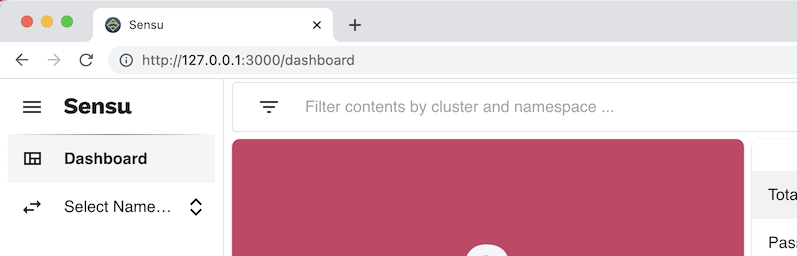
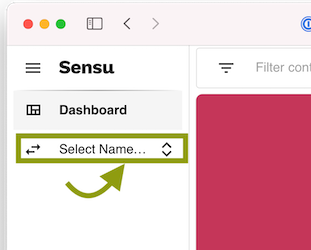
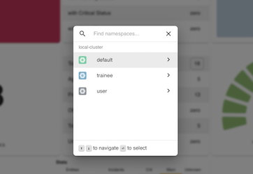
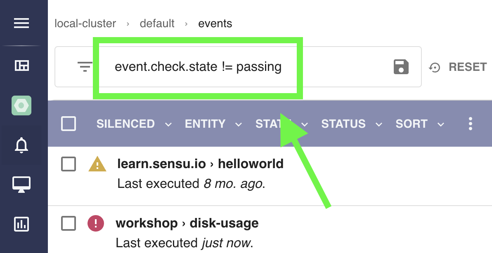
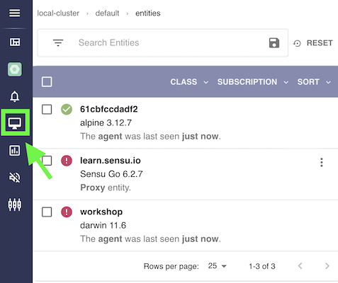
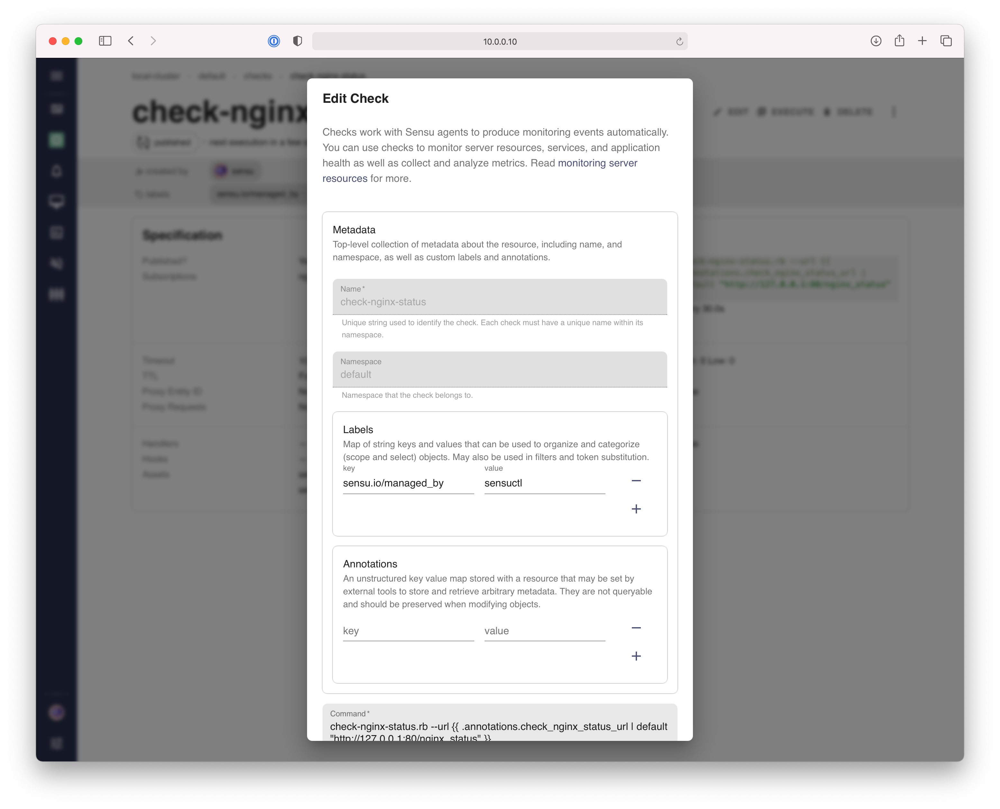

# Lesson 11: Using the Sensu Web App

<!-- TOC GFM -->

- [Goals](#goals)
- [A Visual Overview of Your System](#a-visual-overview-of-your-system)
  - [EXERCISE 1: Entity Scavenger Hunt](#exercise-1-entity-scavenger-hunt)
- [Navigating Between Namespaces](#navigating-between-namespaces)
  - [EXERCISE 2: Select a Namespace](#exercise-2-select-a-namespace)
- [View Event Data](#view-event-data)
  - [EXERCISE 3: View All Events](#exercise-3-view-all-events)
- [View Inventory Data](#view-inventory-data)
  - [EXERCISE 4: View Agent Entities](#exercise-4-view-agent-entities)
- [Managing Silences](#managing-silences)
  - [EXERCISE 5: Create a Silence for an Entity](#exercise-5-create-a-silence-for-an-entity)
- [View and Modify Resource Configurations](#view-and-modify-resource-configurations)
  - [EXERCISE 6: Modify a Check](#exercise-6-modify-a-check)
- [Discussion](#discussion)
  - [Web App is Just Another API Client](#web-app-is-just-another-api-client)
- [Learn More](#learn-more)
- [Next Steps](#next-steps)

<!-- TOC -->

## Goals
In this lesson we will introduce the Sensu Web Application.
In the Sensu web app, you will find an overview of the system in the dashboard, learn to navigate and inspect Sensu resources, and create and delete silences.
This lesson is intended for operators of Sensu and assumes you have [set up a local workshop environment][setup_workshop].

## A Visual Overview of Your System

When you first connect to the [Sensu Web App](https://127.0.0.1:3000), you will see the _dashboard_.
This view shows a general overview of your system.

You can access this within the workshop by opening [https://127.0.0.1:3000](https://127.0.0.1:3000) in a browser.

**Example:** Launching the Sensu Web App from a Command-Line
```shell
open https://127.0.0.1:3000
```

### EXERCISE 1: Entity Scavenger Hunt

#### Scenario

You want a quick visual understanding of the state of your system.
While `sensuctl` provides a versatile tool, it's a little too granular.
You'd like to see a big-picture view from your web browser.

Specifically, you want to find out how many entities are in your system overall.

#### Solution
Sensu includes a built-in web app, with a dashboard, hosted by the backend.
The dashboard shows a lot of useful information, including a count of entities in your system.

#### Steps

1. **Open the Sensu Web App.**

   Navigate to the Sensu Web App's dashboard.
   In the workshop environment, this is available on `localhost`via port `3000`.

   **Browser**
   <figure>
     
     <figcaption><em>Figure 1: The Sensu Dashboard provides a high-level overview of your system..</em></figcaption>
   </figure>

   **MacOS/Linux**:
   ```shell
   open https://127.0.0.1:3000/dashboard
   ```

   **Windows (PowerShell)**
   ```powershell
   Start https://127.0.0.1:3000/dashboard
   ```

1. **Find the Count of Entities**

   * **Scavenger Hunt:** How many entities are available? 

     On the dashboard you should be able to easily, and intuitively locate this information.

1. **Verify Against the Sensu CLI**

   The same information is available from the `sensuctl` CLI tool, however it is more difficult to derive this information.

   ```shell
   sensuctl entity list --format json | jq '. | length'
   ```

   Do these two numbers match? Which one was easier/faster to work with? 

## Navigating Between Namespaces

In Sensu, most Sensu data is accessed on a per-namespace basis. 
The web app allows you to easily switch between different namespaces.

To select the namespace, first go to the left-hand sidebar and click the namespace selector:

<figure>
  
  <figcaption><em>Figure: The namespace switcher, available from the left-hand sidebar, opens a dialog that allows you to pick which namespace you wish to view/interact with.</em></figcaption>
</figure>

Clicking this will open the namespace selection dialog, where you can search for a namespace and select the one you want to work with.

### EXERCISE 2: Select a Namespace

#### Scenario

You want to use the web app to interact with resources like events, entities, checks and handlers.
Since these are all scoped by namespace, you must first select a namespace to view.

#### Solution

To switch namespaces, use the namespace selector. 
When you switch to a namespace, the left navigation menu will load, providing access to the various Sensu resources.

#### Steps

1. **Open the Navigation Switcher**

   On the left-hand toolbar, click the namespace switcher icon.

   **Browser**
   
    

1. **Find the `default` Namespace**

   So far in the workshop, we are only working with the `default` namespace. 
   You can either browse the list of namespaces, or search for it by typing the name.

   **Browser**
  
   

1. **Observe the New Toolbar Options**

   After selecting the namespace, you'll notice that new options appeared in the left-hand toolbar. 
   You now have access to your events, entities, and much more.

   **Browser**
 
   
   
## View Event Data

When you select a namespace, the first thing you'll see is the events list. 
The events list can be filtered using Sensu Query Expressions (SQE), just like the filters we previously wrote for our handler. 

By default, this list has an automatic filter to show only events with a non-passing status (i.e. `event.check.state != passing`).

<figure>
  
  <figcaption><em>Figure: The default filter for the events list only shows events that are with a non-passing status.</em></figcaption>
</figure>

### EXERCISE 3: View All Events

#### Scenario

You want to view the full list of events in Sensu, even ones that are currently passing. 

#### Solution

The events list has a default filter that only shows events in a non-passing status.
To show all events, we need to remove this filter.

#### Steps

1. **Remove the Default Filter**

   Click on the text-box and remove the contents.
   Hit enter to update the list.

   **Browser**
 
   https://user-images.githubusercontent.com/478164/138917565-6a3c0b3f-8e49-4957-9671-e4769eb3d0a7.mov
   
## View Inventory Data 

In a [previous lesson][lesson-3] we discussed how Sensu can be used to mantain an inventory of nodes.
This list of entities can also be viewed from the Sensu web app.


### EXERCISE 4: View Agent Entities

#### Scenario

You want to browse a list of nodes in your system, and get detailed information about specific entities. 

#### Solution

To accomplish this, navigate to the entity list in the Sensu Web App.
This list has search and filter controls as well as some handy bulk functions like silencing and deleting entities.

#### Steps

1. **Navigate to the entity list.**

   In the left-hand toolbar, click the icon that looks like a computer screen.
   This will bring up a list of all entities in the system.

   

1. **Search for a specific entity.**

   At the top of the list, there is a search bar, which allows you to use Sensu Query Expressions (SQE) to filter the list of entities.

   Try typing in the entity `learn.sensu.io`. Sensu will automatically understand that you're looking for an entity with that name and populate the search box with the correct SQE.

   > _NOTE:_ You can also click on any entity to view its properties in detail. 

   https://user-images.githubusercontent.com/478164/138918610-fc2f0e74-4ba5-4308-9f73-f7efead9220c.mov

## Managing Silences

Users can use the Sensu web app to silence individual events (for a single entity), all events produced by a specific check (across multiple entit
ies), or all events for a specific entity.

Silencing may be applied from various different locations in the Sensu web app, with prompts to configure the silencing rules (which check and/or
entity should be silenced), schedule (e.g. to begin immediately, or create a "scheduled maintenance" window), and the reason for the silencing.

### EXERCISE 5: Create a Silence for an Entity

#### Scenario

You want to silence alerts from a particular node so that you can do some maintenance on it, and prefer to use the web app for this task.

#### Solution

The Sensu web app allows you to manage silences in many places.
To configure a silence for a specific entity, we can navigate to to entity detail page, and create a silence directly from there. This will be auto-populated with the correct entity-specific subscription. 

#### Steps

1. **Create a silence for an entity**

   First navigate to the entity list, and select the `workshop` entity.
   Next, click the `SILENCE` button to the right of the entity name.
   This will display a modal window where you can create a silence.

   The silence's subscription will automatically be populated for the `workshop` entity. 

   If you add a check name, it will silence only events from that check, or if you leave that as default, it will silence all events coming from that entity. 

   https://user-images.githubusercontent.com/478164/138918724-2818d4ab-2171-4f12-964d-55cdef2a505d.mov

1. **Delete a silence.**

   Navigate to the list of silences via the left-hand toolbar, or by clicking on the popup alert.
   You will see the silence we just made.
   Click on the right hand dots menu and select "Clear Silence", then confirm.
   
   The silence is now deleted.

   
## View and Modify Resource Configurations 

The Sensu web app also provides access to the core monitoring configuration, including Checks, Fitlers, Mutators, and Handlers.
The configuration views may be accessed from the navigation sidebar.
Each of the configuration resources provides list + detail views, as well as the ability to create and/or edit configuration resources (e.g. modify check or handler configuration), assuming the user has the appropriate RBAC permissions.



### EXERCISE 6: Modify a Check
_Coming Soon..._

<!--

#### Scenario

#### Solution

#### Steps

1. **Step 1 Description**

1. **Step 2 Description**
-->

## Discussion

In this lesson you learned the basics of how to navigate the Sensu Web Application, including how to view inventory, add and remove silences, and modify check configurations. 

### Web App is Just Another API Client

Sensu's monitoring as code solution is possible thanks to a robust set of APIs.
The Sensu web app and CLI are effectively just API clients that streamline access to these APIs.
Both tools have access to the same information and give you the power to view and change Sensu resources, using different paradigms.
Use whichever tool works best for your workflow.

To learn more about the Sensu APIs, please checkout the [Sensu API Reference Documentation](https://docs.sensu.io/sensu-go/latest/api/) and [Sensu
 Developer Workshop](/README.md#developer-workshop) (coming soon).

## Learn More
<!-- Add related links that expand on the topic here. -->
- [[Blog Post] "A Primer on Sensu Dashboards" (sensu.io)](https://sensu.io/blog/a-primer-on-sensu-dashboards-eb0940293a)
- [[Documentation] "View and manage resources in the web UI" (sensu.io)](https://docs.sensu.io/sensu-go/latest/web-ui/view-manage-resources/)
- [[Documentation] "Search in the web UI" (sensu.io)](https://docs.sensu.io/sensu-go/latest/web-ui/search/)

## Next Steps

<!-- This concludes the [Building Blocks 101](../04/README.md#readme) section of the Sensu Workshop. If you're ready to learn more, move on to the next section, [Building Blocks 201](../12/README.md#readme).
-->

[Share your feedback on Lesson 11](https://github.com/sensu/sensu-go-workshop/issues/new?template=lesson_feedback.md&labels=feedback%2Clesson-11&title=Lesson%2011%20Feedback)

[Next Lesson](../12/README.md#readme)

[Previous Lesson](../10/README.md#readme)

<!-- Some Commonly Used Named Links -->

[setup_workshop]: ../02/README.md#readme
[sensu_api_docs]: https://docs.sensu.io/sensu-go/latest/api/

